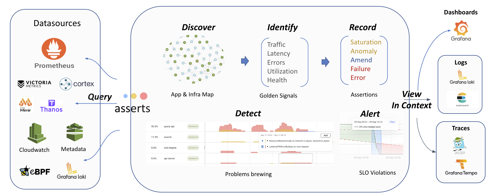
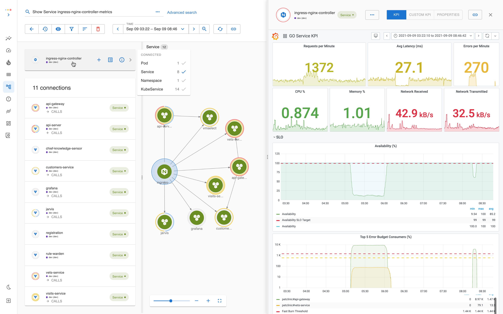
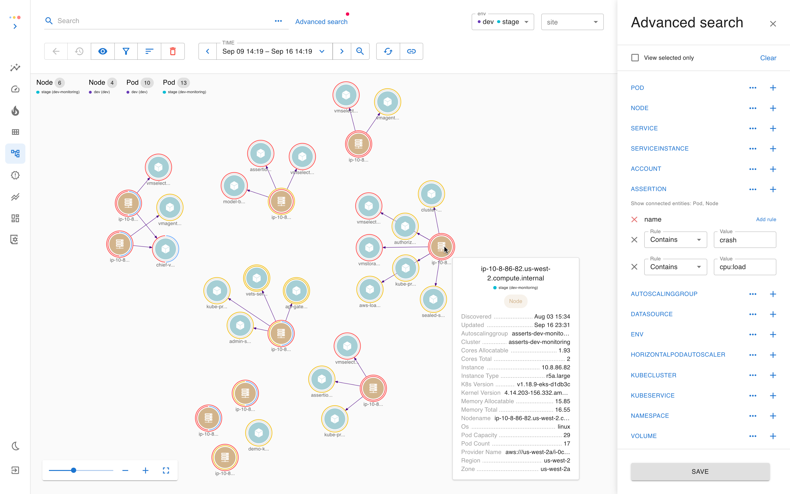
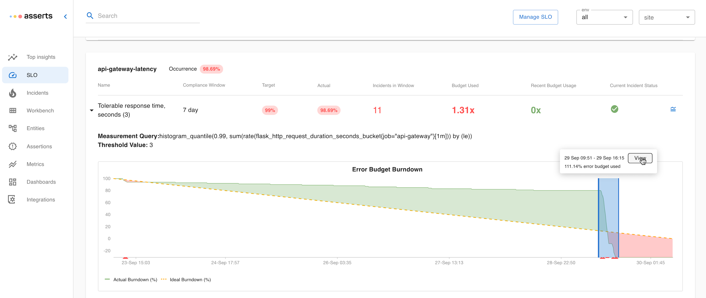
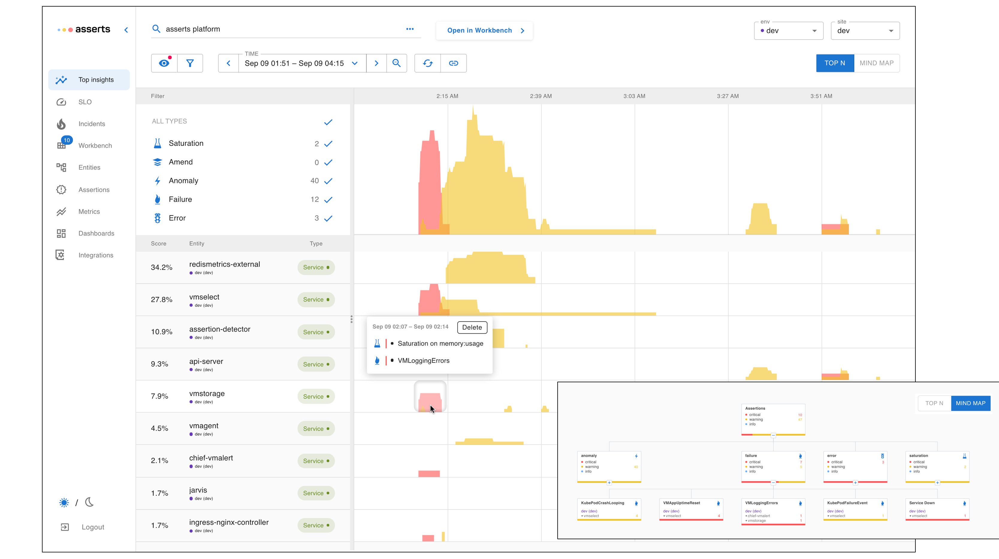

# Features

As an Asserts customer, all you need to do is connect your Observability Datasources like Prometheus, Cloudwatch et al. to Asserts and then let Asserts apply its intelligence to present root cause insights.


Asserts is now part of Grafana Labs. All new customers will be onboarded on Grafana Cloud. Please sign up for early access at [https://www.asserts.ai/](https://www.asserts.ai/)


<figure><figcaption>
Connect your existing Observability Datasources
</figcaption></figure>

### **Builds an Entity Graph of App and Infra components (with Grafana Dashboards)**

Asserts taps into your telemetry data sources like Prometheus, CloudWatch et al., automatically builds a graph of your application and infrastructure components, and indexes the graph for search.

With our search, you can find how the components fit together in real-time and view KPIs in the built-in Grafana dashboard. [see more](user-guide/exploring-the-entity-graph.md)

### Runs curated rules **to detect Service Unavailability and potential causes**

Asserts curates knowledge of common runtime failure patterns and potential causes so your team doesn’t have to research and maintain these complex PromQL recording and alerting rules for frameworks.

It continuously tracks resource _**Saturation**_**s**, _**Amends**_ (i.e. changes such as new container deployments, config updates, kafka consumer group rebalancing, HPA scale events et al.), _**Anomalies**_ in request rate, error rate & latency, systemic _**Failures**_ (e.g. Pod Crash looping, Cron Job Failure), and _**Errors** (e.g 5XX / 4XX status code, Latency Threshold Breach)_ on your [_golden signals_](https://sre.google/sre-book/monitoring-distributed-systems/#xref\_monitoring\_golden-signals) and health metrics.

We call these checks **Assertions**. The occurrences of these assertions are annotated on the (Knowledge) Graph, so it is easy to consume at a glance. [see more](how-asserts-works/understanding-saafe-model.md)

.png>)

Our [assertion catalog](assertion-catalog/overview.md) is constantly evolving.

### **Exploration with Unified Search**

With our unified search, you can combine components, relations, configurations, and associated assertions to express your intent in an easy natural language expression.

_e.g.,_ Search “Pods `crashing` on Nodes with high `cpu:load`” , [see more](https://docs.asserts.ai/user-guide/exploring-the-entity-graph#howassertsworks-wip-entityassertionstatus)

### **Wake up when it matters**

The SRE book recommends [Alerting on Service Level Objectives (SLO)](https://sre.google/workbook/alerting-on-slos/), to track`"what's broken"`and with Asserts setting up your SLOs and tracking your error budget is a breeze. And then finding "why it's broken" is just a click away in our RCA workbench. see more

### **Spot issues quickly with Top Insights**

With our always-on Checks (aka Assertions), you don’t have to wait for SLOs to breach and Alerts to fire. Top Insights presents a stack-ranked view of Services / Nodes that need attention based on their `severity score`.\
And then `Open in Workbench` to find the root cause. [see more](user-guide/top-insights.md)

### **Troubleshoot in Workbench with all the Root cause Insights**

In our assertion workbench, dig in to view all the possible causes correlated across time and dependency, with just the right metrics, logs and traces at your fingertip.

_e.g.,_ an amend (new deployment) on `api-server` triggered a spike in error rate on an endpoint `/slo/incidents`. Jump to `Dashboard` or `View Logs` to see contextual logs in your existing log store, like Kibana, Graylog, et al. [see more](user-guide/workbench.md)

###
