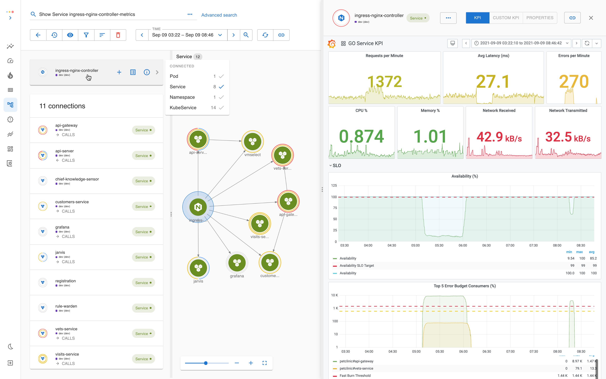
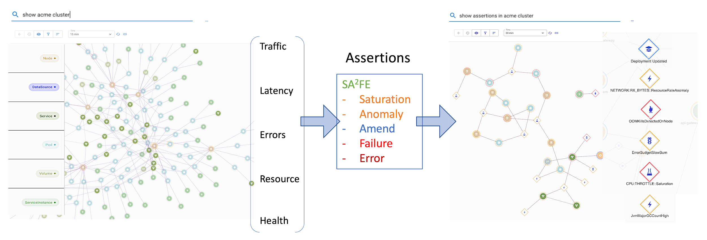
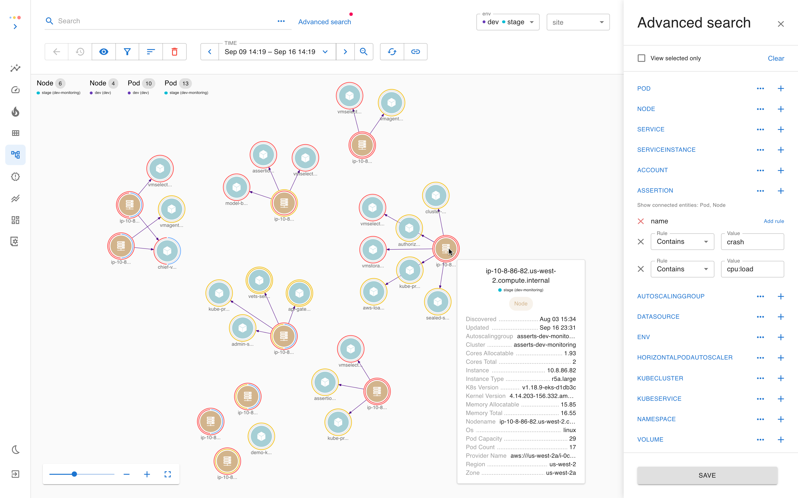
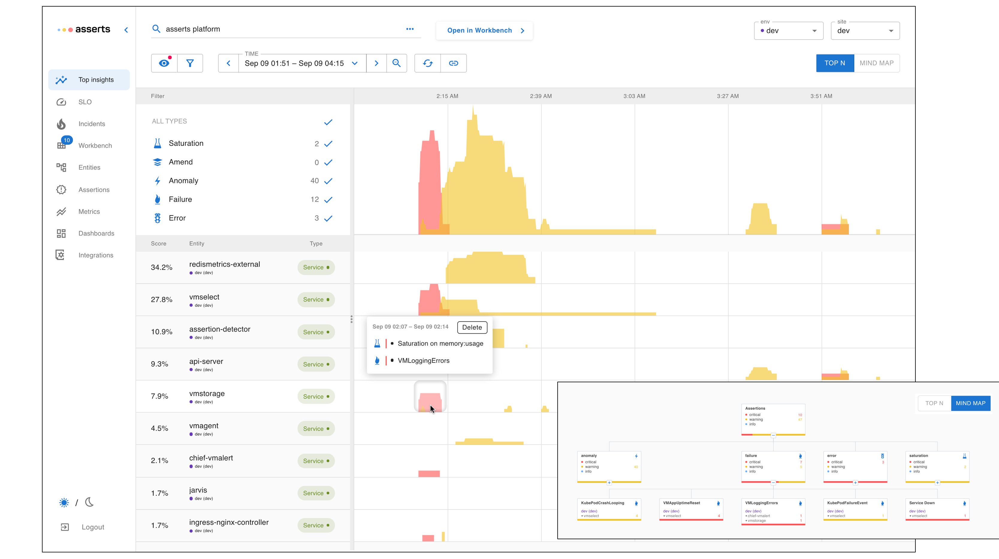
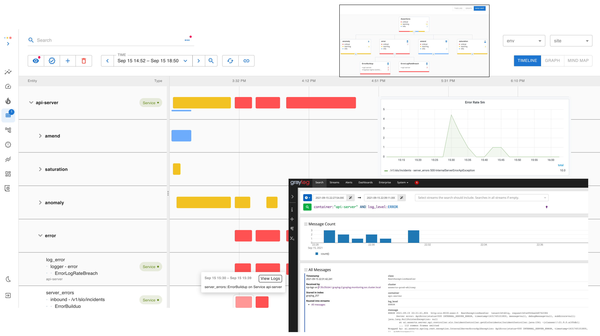
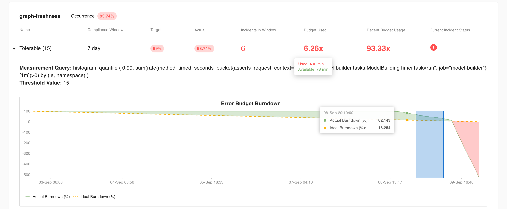

# Asserts

## **Founding Story**

As builders and operators of cloud applications and founding engineers of industry-leading APM products at AppDynamics, we were pinched every day; why was it still so hard to troubleshoot and optimize our app with the modern APM tools? We had [assertions](https://en.wikipedia.org/wiki/Assertion_%28software_development%29) for our compile time with Unit, Component, and Integration tests but couldn’t apply the same rigor to our runtime. There wasn’t a platform to _transcribe our system design_ embedded in the [four golden signals](https://sre.google/sre-book/monitoring-distributed-systems/#xref_monitoring_golden-signals) and health metrics into Runtime Assertions. When we started creating Alerts to track these failures and dashboards to view the metrics, they were disjoint, too many to manage, too noisy to correlate, and will go out of date too soon with our continuous release.

As engineers, we wished for an adaptive and purposefully built solution for _distributed systems and cloud architecture_, and most importantly, that allowed us to manage our _Monitoring as a Code_.

**What is Asserts?**

Asserts is the next-generation insights for your distributed, multi-cloud applications.

With Asserts, your team can say goodbye to disjointed dashboards that don’t keep up with rapid releases. Your expert engineers won’t be constantly interrupted to pour over esoteric squiggly metric charts and regex stacks of logs to find the needle\(in the haystack\). And to top it off, your on-call team won’t be fatigued by alerts that don’t matter.

Let’s dig deeper to find how Asserts is different.

## **Features**

### **Discover a Living Map of App and Infra components**

Asserts taps into your telemetry data sources \(app metrics\), automatically builds a graph of your application and infrastructure components, and indexes the graph for search.

* With our search, you can find how the components fit together in real-time and view KPIs in the built-in Grafana dashboard.

Our [cloud component catalog](cloud-platforms.md) is constantly evolving.

### Instrument **via SAAFE Assertions to collect the symptoms and causes**

Asserts curates knowledge of common runtime failure patterns and potential causes, so your team doesn’t have to research and maintain these rules.

It continuously tracks resource _**Saturation**_, _**Amends**_ \(new deployments, scale events et al.\), request & latency _**Anomalies**_, systemic _**Failures**_, and _**Errors**_ on your [_golden signals_](https://sre.google/sre-book/monitoring-distributed-systems/#xref_monitoring_golden-signals) and health metrics.

The occurrences of these assertions are annotated on the \(Knowledge\) Graph, so it is easy to consume at a glance. 

### **Explore with Unified Search**

With our unified search, you can combine components, relations, configurations, and associated assertions to express your intent in an easy natural language expression.

_e.g.,_ Search “Pods `crashing` on Nodes with high `cpu:load`” 

### **Spot issues quickly with Top Insights**

With our always-on Assertions, you don’t have to wait for Alerts to fire and SLOs to breach. Top Insights presents a stack-ranked view of Services that need attention based on their _assertion score_.

### **Troubleshoot in Workbench with all the Assertions**

You can use the same search expression in our workbench and jump right in to view all the assertions correlated across time and space, with just the right metrics at your fingertip.

_e.g.,_ an amend \(new deployment\) on `api-server`triggered a spike in error rate on an endpoint `/slo/incidents`. Jump to `Dashboard` or `View Logs` to see contextual logs in your existing log store.

### **Wake up when it matters**

The SRE book recommends [Alerting on SLOs](https://sre.google/workbook/alerting-on-slos/), and with Asserts setting up your SLOs and tracking your error budget is a breeze. And then finding the symptoms is just a click away in our workbench.

