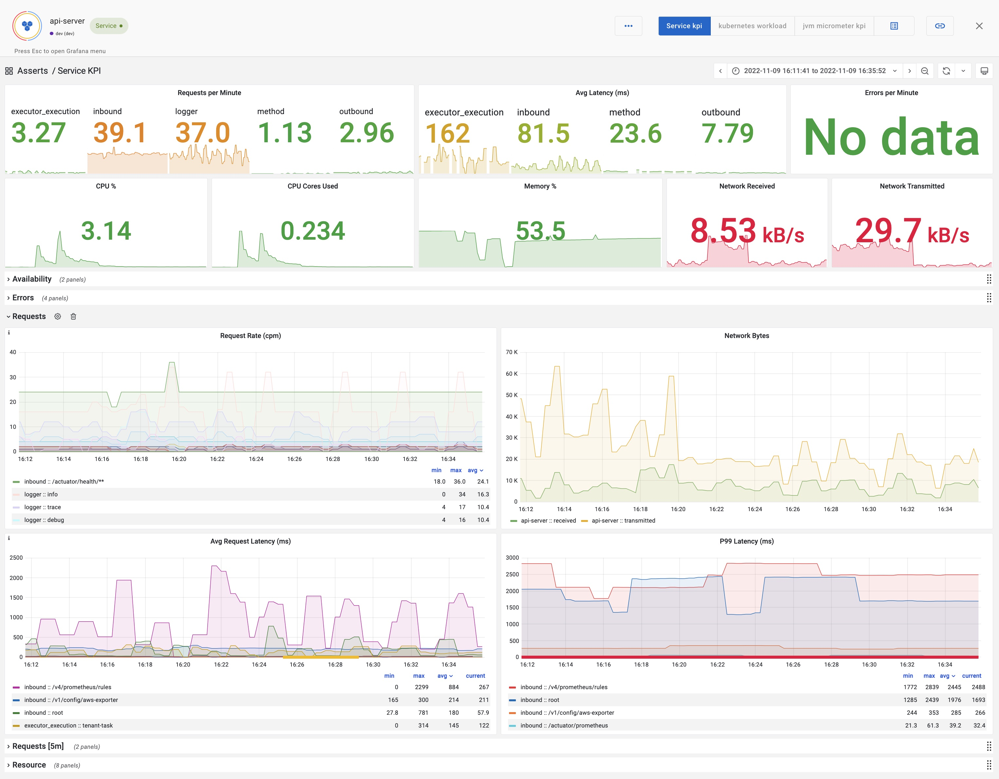

# Springboot

### Setup

[Spring Boot](https://spring.io/projects/spring-boot) is a popular Java framework for building modern applications. With the help of the [actuator](https://docs.spring.io/spring-boot/docs/current/reference/html/actuator.html) module and the [micrometer](https://micrometer.io/) library, we can configure a Spring Boot application to expose performance metrics in the [Prometheus format](https://prometheus.io/docs/concepts/data\_model/).

First, you will need the actuator module to enable all the[ management endpoints](https://docs.spring.io/spring-boot/docs/current/reference/html/actuator.html#actuator.endpoints.exposing), and the micrometer module to provide the prometheus endpoint that exposes Prometheus metrics.

```
dependencies {
    implementation 'org.springframework.boot:spring-boot-starter-actuator',
    Implementation ‘io.micrometer:micrometer-registry-prometheus’
}
```

Second, make sure the Prometheus endpoint is enabled in your application.properties or application.yml:

```
management.endpoints.web.exposure.include=info, health, prometheus
management.endpoint.prometheus.enabled=true
```

Now if you hit the /actuator/prometheus endpoint of your web application, you will see a list of metrics like these:

```
jvm_memory_used_bytes{area="heap",id="PS Survivor Space",} 2.012508E7
…
http_server_requests_seconds_count{exception="None",method="GET",outcome="SUCCESS",status="200",uri="/actuator/metrics",} 1.0
http_server_requests_seconds_sum{exception="None",method="GET",outcome="SUCCESS",status="200",uri="/actuator/metrics",} 0.084955379
…
http_client_requests_seconds_count{clientName="chief.tsdb.dev.asserts.ai",method="POST",outcome="SUCCESS",status="200",uri="/select/0/prometheus/api/v1/query",} 4785.0
http_client_requests_seconds_sum{clientName="chief.tsdb.dev.asserts.ai",method="POST",outcome="SUCCESS",status="200",uri="/select/0/prometheus/api/v1/query",} 238.762194814
…
```

### RED Metric KPIs

Asserts will automatically track the following list of Key performance indicators for your Request, Error and Duration aka RED metrics.&#x20;

<table data-header-hidden><thead><tr><th></th><th data-hidden>Metric</th></tr></thead><tbody><tr><td><p><strong>Request Rate</strong></p><ul><li><em><strong>Inbound</strong>  </em>  <br> <em>rate(http_server_requests_seconds_count[5m])</em></li><li><em><strong>Outbound</strong> </em> <br> <em>rate(</em>http_client_requests_seconds_count<em>[5m])</em><br> <em>rate(</em>gateway_requests_seconds_count[5m])</li><li><strong>Method</strong><br> <strong></strong> rate(method_timed_seconds_count[5m])</li><li><strong>Executor</strong><br><strong></strong><em>rate(executor_execution_seconds_count[5m])</em></li><li><em><strong>Logger</strong></em><br><em><strong></strong></em>rate(logback_events_total[5m])</li></ul></td><td><p>Request Counter</p><p>http_server_requests_seconds_count</p></td></tr><tr><td><p><strong>Error Ratio - Inbound, Outbound and Method et al.</strong></p><ul><li><strong>Server (5xx) errors</strong> <br><strong></strong><em>rate(http_server_requests_seconds_count{status=~"5.."}[5m])/</em> <br><em>rate(http_server_requests_seconds_count[5m])</em></li><li><strong>Client (4xx) errors</strong><br><em>rate(http_server_requests_seconds_count{status=~"4.."}[5m])/ rate(http_server_requests_seconds_count[5m])</em></li><li><em><strong>Method Errors</strong></em><br><em><strong></strong></em>rate(method_timed_seconds_count{exception!="none"}}[5m])/ rate(method_timed_seconds_count[5m])</li><li><strong>Logger Errors</strong><br><strong></strong>rate(logback_events_total{level="error"}[5m])</li></ul></td><td><p>Error Counter</p><p>http_server_requests_seconds_count</p></td></tr><tr><td><p><strong>Latency - Inbound, Outbound, Method, Executor et al.</strong></p><ul><li><strong>Average</strong><br><strong></strong><em>rate(http_server_requests_seconds_sum[5m])/ rate(http_server_requests_seconds_count[5m])</em></li><li>P99<br><em>histogram_quantile(</em><br>  <em>0.99,</em><br>  <em>sum(rate(http_server_requests_seconds_bucket[5m]))</em><br>     <em>by (le, uri, job, ...)</em><br><em>)</em></li></ul></td><td><p>Latency Histogram</p><p>http_server_requests_seconds</p></td></tr></tbody></table>

### RED Metrics Alerts

Asserts automatically tracks the short-term and long-term trends for request and latency for Anomaly detection by _URI_ and _method_ names. Similarly, thresholds can be set for Latency averages and P99 to record breaches. Error Ratios are tracked against availability goals (default, 99.9%) and breaches (default, 10%)&#x20;

| KPI                                      | Alerts                                                                                                                                  |
| ---------------------------------------- | --------------------------------------------------------------------------------------------------------------------------------------- |
| Request Rate                             | <p><strong>RequestRateAnomaly</strong> <br> <strong></strong> - Inbound, Outbound, Method, Executor, Logger</p>                         |
| Error Ratio                              | <p><strong>ErrorRatioBreach</strong></p><p><strong>ErrorBuildup</strong> - availability goal 99.9 %</p>                                 |
| <p>Latency Average</p><p>Latency P99</p> | <p><strong>LatencyAverageBreach</strong></p><p><strong>LatencyAverageAnomaly</strong></p><p><strong>LatencyP99ErrorBuildup</strong></p> |
| Error Log                                | **ErrorLogRateBreach**                                                                                                                  |

### JVM GC Alerts

Asserts tracks the JVM GC Count and Time  from micrometer metrics, the thresholds are tunable

| JVM GC                                                                                                                                                                                                                                                             |
| ------------------------------------------------------------------------------------------------------------------------------------------------------------------------------------------------------------------------------------------------------------------ |
| <p><strong>JvmMajorGCTimeHigh</strong> <br><em>rate(jvm_gc_pause_seconds_sum{action="end of major GC"}[2m]) * 120 > 0.10 * 120</em> <br>  <em>unless on (job, service, instance, asserts_env, asserts_site) process_uptime_seconds &#x3C; 300</em></p>             |
| <p><strong>JvmMajorGCCountHigh</strong><br><em><strong></strong>rate(jvm_gc_pause_seconds_count{action="end of major GC"}[2m]) * 120 > 10</em>  <br>  <em>unless on (job, service, instance, asserts_env, asserts_site) process_uptime_seconds &#x3C; 300</em></p> |
|                                                                                                                                                                                                                                                                    |

### Dashboards

#### Service KPI Dashboard

Asserts aggregates data from micrometer, cAdvisor,  kubelet and node-exporter to present a dashboard with the following KPIs:

* Request Rate
* Latency Average
* Latency P99
* Error Rate
* CPU %
* CPU Cores Used
* CPU Throttle
* Memory %
* Memory Bytes
* Disk Usage
* Network Usage



#### JVM Micrometer KPI Dashboard

This dashboard has the following KPIs:

* JVM memory
* CPU-Usage, Load, Threads, Thread States, File Descriptors, Log Events
* JVM Memory Pools (Heap, Non-Heap)
* Garbage Collection
* Classloading
* Direct-/Mapped-Buffer

.png>)
