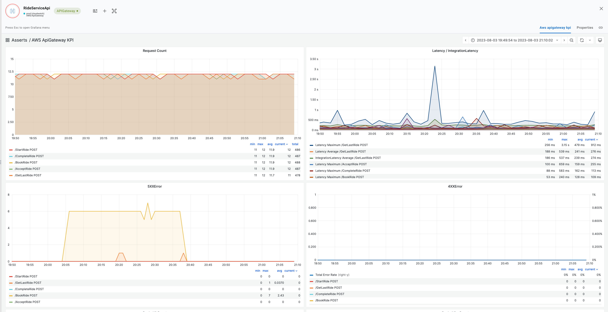

# ApiGateway

### Setup

#### **Asserts AWS Exporter**

Refer to [aws-cloudwatch.md](../../../integrations/data-source/aws-cloudwatch.md "mention") on how to install Asserts AWS Exporter.

### Key Performance Indicators (KPIs) and Alerts

The AWS Exporter discovers the ApiGateway and also converts any CloudWatch alarms firing on it into metrics. If you are using Asserts, the CloudWatch alarms are converted into alerts.

### KPI Dashboard

The API gateway KPI Dashboard shows the following KPIs

* Request Rate
  * **Sum(RequestCount)**
* Error Rate
  * **Sum(4XXError)**
  * **Sum(5XXError)**
* Latency
  * **Avg(Latency)**
  * **Max(Latency)**
  * **Avg(IntegrationLatency)**
* Cache Hit/Miss counts
  * **Sum(CacheHitCount)**
  * **Sum(CachMissCount)**

**Dashboard**

Asserts has built-in dashboard for ApiGateway which shows the key KPIs

<figure><figcaption></figcaption></figure>
