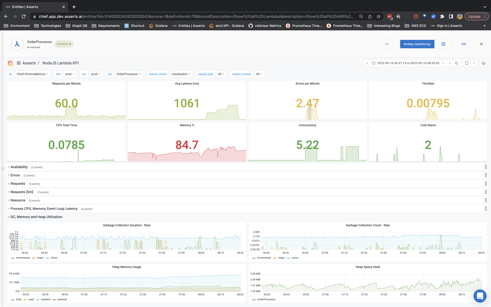

# Lambda

#### **Asserts AWS Exporter**

Refer to [aws-cloudwatch](../../../integrations/data-source/aws-cloudwatch/ "mention") on how to install the AWS Exporter.

#### Asserts Lambda Layer

The Asserts Lambda layer needs to be added to the Lambda function. Lambda layers are available for [NodeJS](https://github.com/asserts/asserts-aws-lambda-layer-js) and [Python](https://github.com/asserts/aws-lambda-layer-python). Refer to the GitHub project documentation for instructions on how to install the layer and include it in one or more Lambda functions. There is a convenient utility script to add, remove, and upgrade the layer version in multiple Lambda functions in one go.

### Key Performance Indicators (KPIs) and Alerts

#### Request, Errors, and Latency

| **Metric**                                                   | **Key Performance Indicator (KPI)**                                                                                                                                                                                |
| ------------------------------------------------------------ | ------------------------------------------------------------------------------------------------------------------------------------------------------------------------------------------------------------------ |
| 
Request Counter

aws_lambda_invocations_total
    | 
Request Rate

rate(aws_lambda_invocations_total[5m])
                                                                                                                                                   |
| 
Error Counter

aws_lambda_errors_total
           | 
Error Ratio

rate(aws_lambda_invocations_total[5m])/ rate(aws_lambda_invocations_total[5m])
                                                                                                            |
| 
Latency Histogram

aws_lambda_duration_seconds
   | 
Latency Average

rate(aws_lambda_duration_seconds_sum[5m])/ rate(aws_lambda_duration_seconds_count[5m])

Latency P99

histogram_quantile(0.99, sum(rate(aws_lambda_duration_seconds_sum[5m])
 |
| 
Request Throttle Count

aws_lambda_throttles_sum
 | 
Observe throttle count for Sustained Throttling

aws_lambda_throttles_sum
                                                                                                                              |

#### Resource

| **Metric**                                                                                            | **Key Performance Indicator (KPI)**                                                                                                                                                                                                                                 |
| ----------------------------------------------------------------------------------------------------- | ------------------------------------------------------------------------------------------------------------------------------------------------------------------------------------------------------------------------------------------------------------------- |
| 
Memory NodeJS

process_heap_bytes

Memory Python

process_resident_memory_bytes
 | 
<strong>NodeJS</strong>

process_heap_bytes / aws_lambda_memory_limit_mb

<strong>Python</strong>

process_resident_memory_bytes / aws_lambda_memory_limit_mb
                                                                                 |
| 
CPU Total Time

<code>process_cpu_seconds_total</code>
                                    | 
CPU Time Usage

<code>rate(process_cpu_seconds_total[5m])</code>
                                                                                                                                                                                        |
| 
Concurrent Executions

aws_lambda_concurrent_executions_avg
                               | 
When concurrency is reserved at the function level

aws_lambda_concurrent_executions_avg / aws_lambda_allocated_concurrency

For account level

aws_lambda_concurrent_executions_avg / aws_lambda_account_limit{type="concurrent_executions"}
 |

**Alerts**

| **KPI**                | **Alert**                                                                                                                   |
| ---------------------- | --------------------------------------------------------------------------------------------------------------------------- |
| Request Rate           | **RequestRateAnomaly**                                                                                                      |
| Error Ratio            | **ErrorRatioBreach** and **ErrorBuildup** based on an availability SLO of 99.9                                              |
| Latency Average        | **LatencyAverageBreach** and **LatencyAverageAnomaly**                                                                      |
| Latency P99            | **LatencyP99ErrorBuildup**                                                                                                  |
| Request Throttle Count | **LambdaFunctionThrottled**                                                                                                 |
| Memory Utilization     | **Saturation** with severity level of **warning** and **critical** when memory utilization exceeds 90% and 95% respectively |
| CPU Time Usage         | **ResourceRateAnomaly**                                                                                                     |
| Network Bytes          | **ResourceRateAnomaly**                                                                                                     |
| Lambda Concurrency     | **Saturation** at Function and Account level                                                                                |

### KPI Dashboard

The Lambda KPI Dashboard shows all the KPIs and also the Cold Starts for correlation with Traffic Spike and Latency degradation

<figure><figcaption>
Lambda KPI for a NodeJS Lambda function
</figcaption></figure>
