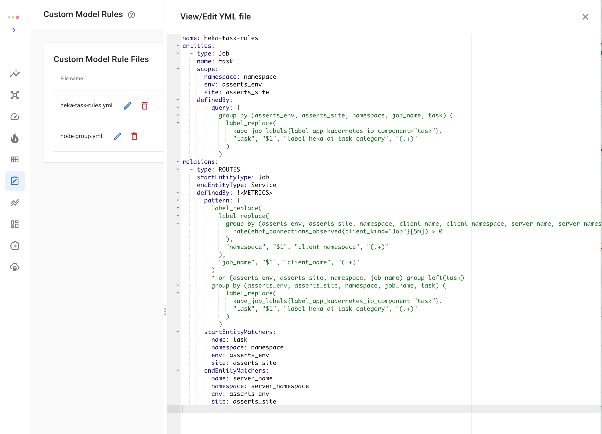

# MongoDB

### Setup

The [Percona MongoDB Exporter](https://github.com/percona/mongodb\_exporter) is recommended to export MongoDB metrics in Prometheus format.&#x20;

The docker version of the exporter can be started as follows:

```
docker run -d -p 9216:9216 -p 17001:17001 percona/mongodb_exporter:0.39 --mongodb.uri=mongodb://mongodb:17001
```

The `MONGODB_USER` and `MONGODB_PASSWORD` can be used to pass credentials. Alternatively, you can use the [MongoDB exporter Prometheus community helm chart](https://github.com/prometheus-community/helm-charts/tree/main/charts/prometheus-mongodb-exporter).

For details on the various options in the exporter, please take a look at the [usage guide](https://github.com/percona/mongodb\_exporter/blob/main/REFERENCE.md).

### Metrics

#### Request and Errors

| Metric                                                                                               | Key Performance Indicator                                                                                                                             |
| ---------------------------------------------------------------------------------------------------- | ----------------------------------------------------------------------------------------------------------------------------------------------------- |
| <pre><code>mongodb_op_counters_total
</code></pre>                                                   | <p>Request Rate</p><p><code>rate(mongodb_op_counters_total[5m])</code></p>                                                                            |
| <p></p><pre><code>mongodb_op_counters_repl_total
mongodb_mongod_op_counters_repl_total
</code></pre> | <p>Request Rate </p><p><code>rate(...[5m])</code></p>                                                                                                 |
| <p></p><pre><code>mongodb_mongod_op_latencies_ops/latencies_total
</code></pre>                      | <p>Latency Average </p><pre><code>rate(mongodb_mongod_op_latencies_latency_total[5m])
/
rate(mongodb_mongod_op_latencies_ops_total[5m])
</code></pre> |

#### Resource Metrics

| Metric                                     | Key Performance Indicator                                                                                                                                                                                                              |
| ------------------------------------------ | -------------------------------------------------------------------------------------------------------------------------------------------------------------------------------------------------------------------------------------- |
| Connection Counts `mongodb_ss_connections` | <p>Connection Usage</p><pre><code>mongodb_ss_connections{conn_type="current"} 
  / ignoring(conn_type)
(mongodb_ss_connections{conn_type="current"} + ignoring(conn_type) mongodb_ss_connections{conn_type="available"})
</code></pre> |

### Alerts

| KPI              | Alert                                                                             |
| ---------------- | --------------------------------------------------------------------------------- |
| Request Rate     | **RequestRateAnomaly**                                                            |
| Latency Average  | **LatencyAverageAnomaly, LatencyAverageBreach**                                   |
| Connection Usage | **Saturation** with a severity level of **critical** when utilization exceeds 90% |

#### Failure Alerts


| Alert                             | Description                                                                                                                                                             |
| --------------------------------- | ----------------------------------------------------------------------------------------------------------------------------------------------------------------------- |
| **MongodbDown**                   | Fires when Mongo DB is down                                                                                                                                             |
| **MongodbReplicaMemberUnhealthy** | Fires when a replica in a replication set is unhealthy                                                                                                                  |
| **MongodbReplicationLag**         | Fires when the replication lag of a secondary is more than a configured time duration. Severity is set to **warning** when lag > 60s and **critical** when lag > 240s.  |
| **MongodbReplicationHeadroom**    | Fires when the replication lag of a secondary is more than a configured time duration. Severity is set to **warning** when lag > 60s and **critical** when lag > 240s.  |
| **MongodbTooManyCursorsOpen**     | Fires when the number of open cursors is above a given threshold. By default, the threshold is set to 10000. Severity is set to **warning.**                            |
| **MongodbTooManyCursorTimeouts**  | Fires if the rate of cursor timeout is above a certain threshold. By default, the threshold is set to 100. Severity is set to **warning**.                              |
| **MongodbInternalErrors**         | Fires when the count of internal errors keeps growing for 5m. Severity is set to **warning**                                                                            |
| **MongodbUserErrors**             | Fires when the count of user errors keeps growing for 5m. Severity is set to **warning.**                                                                               |
| **ReadRequestsQueueingUp**        | If the read queue keeps growing for 5m. Severity is set to **warning.**                                                                                                 |
| **WriteRequestsQueueingUp**       | If the write queue keeps growing for 5m. Severity is set to **warning.**                                                                                                |

### Dashboard

<figure><figcaption><p>MongoDB Instance Summary Dashboard</p></figcaption></figure>
