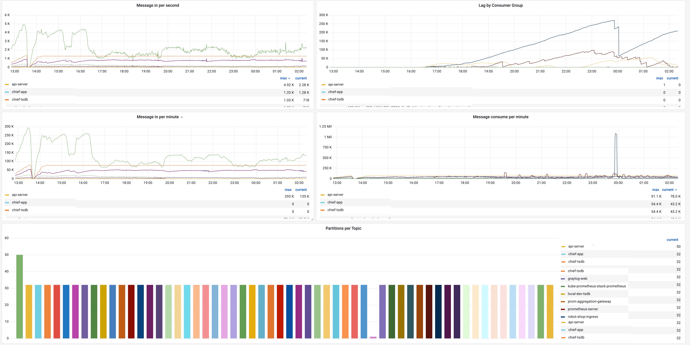

# Kafka

## Kafka Server 

### Setup 

Kafka server can be enabled for Prometheus metrics either using an external exporter or JMX exporter.

* Kafka exporter can be set up using instructions mentioned here - [Exporter](https://github.com/danielqsj/kafka\_exporter)

> docker run -ti --rm -p 9308:9308 danielqsj/kafka-exporter --kafka.server=kafka:9092 \[--kafka.server=another-server ...]

* JMX Exporter can be set up and configured using [JMX Exporter](https://github.com/prometheus/jmx\_exporter) , while launching the Kafka server you can use the below command to launch

> `java -javaagent:./jmx_prometheus_javaagent-0.16.1.jar=8080:config.yaml -jar yourJar.jar`

* An alternative way to configure in case Kafka is running using script

`KAFKA_OPTS="$KAFKA_OPTS -javaagent:./jmx_prometheus_javaagent-0.16.1.jar=8080:./kafka-2_0_0.yml" kafka-server-start /usr/local/etc/kafka/server.properties`

After the Kafka server is successfully enabled for the Prometheus metric, you can verify whether you are able to see some of the following metrics in Prometheus.

`kafka_topic_partitions{topic="__consumer_offsets"}` \
`kafka_topic_partition_current_offset gauge kafka_topic_partition_current_offset{partition="0",topic="__consumer_offsets"}`

### RED Metrics KPI 

#### Request Rate

Asserts will automatically track the following list of Key performance indicators for your Request, Error, and Duration, aka RED metrics.

* **Kafka JMX RED Metrics KPI**
  * **Producer Requests** \
    ****`rate(kafka_server_brokertopicmetrics_totalproducerequests_total[5m])`
  * **Producer Records**\
    ****`rate(kafka_server_brokertopicmetrics_messagesin_total[5m])`
  * **Consumer Requests**\
    ****`rate(kafka_server_brokertopicmetrics_totalfetchrequestspersec_count{topic!=""}[5m])`
* **Kafka Exporter RED Metrics KPI**
  * **Produced Messages**\
    &#x20;**** `avg_over_time((delta(kafka_topic_partition_current_offset{topic!=""}[1m]) > 0 or delta(kafka_topic_partition_current_offset{topic!=""}[1m]) * 0) / 60 [5m])`
  * **Consumed Messages**\
    ****`avg_over_time((delta(kafka_consumergroup_current_offset{topic!=""}[1m]) > 0 or delta(kafka_consumergroup_current_offset{topic!=""}[1m]) * 0) / 60 [5m])`

#### Error Ratio

* **Producer Errors**\
  _`rate(kafka_server_brokertopicmetrics_failedproducerequests_total{topic!=""}[5m])/rate(kafka_server_brokertopicmetrics_totalproducerequests_total[5m])`_
* **Consumer Errors**\
  _`rate(kafka_server_brokertopicmetrics_total_failedfetchrequestspersec_count{topic!=""}[5m])/ rate(kafka_server_brokertopicmetrics_totalfetchrequestspersec_count{topic!=""}[5m])`_

#### Latency

* **P99 - Consumer Request**\
  ****`kafka_network_requestmetrics_totaltimems{request="Fetch", quantile="0.99"} / 1000`
* **P99 - Consumer Group**\
  ****`kafka_network_requestmetrics_totaltimems{request=~".*Group", quantile="0.99"}) / 1000`
* **P99 - Producer Request**\
  ****`kafka_network_requestmetrics_totaltimems{request="Produce",quantile="0.99"} / 1000`
* **P99 - Broker Request**\
  ****`kafka_controller_controllerchannelmanager_requestrateandqueuetimems{quantile="0.99"} /1000`

### RED Metrics Alerts 

Asserts automatically tracks the short-term and long-term trends for request and latency for Anomaly detection. Similarly, thresholds can be set for Latency averages and P99 to record breaches. Error Ratios are tracked against availability goals (default, 99.9%) and breaches (default, 10%)&#x20;

| **KPI**      | **Alerts**                                                                                              |
| ------------ | ------------------------------------------------------------------------------------------------------- |
| Request Rate | **RequestRateAnomaly**                                                                                  |
| Error Ratio  | 
<strong>ErrorRatioBreach</strong>

<strong>ErrorBuildup</strong> - availability goal 99.9 %
 |
| Latency P99  | **LatencyP99ErrorBuildup**                                                                              |

### Failure Alerts 

**KafkaTopicsUnderReplicatedPartitions**\
`kafka_topic_partition_under_replicated_partition > 0`

**KafkaOfflinePartitions**\
****`kafka_controller_kafkacontroller_offlinepartitionscount > 0`

**KafkaActiveController**\
****`kafka_controller_kafkacontroller_activecontrollercount != 1`

**KafkaUnderMinIsrPartitions**\
****`kafka_cluster_partition_underminisr > 0`

### Dashboards 

The below dashboard shows information about Kafka server metrics

* Messages Produced
* Messages Consumes
* Lag by Consumer
* Partitions for Topics

<figure><figcaption></figcaption></figure>

## Kafka Client 

### Setup 

JMX Exporter can be set up and configured using [JMX Exporter](https://github.com/prometheus/jmx\_exporter) , while launching the Kafka client you can use the below command to launch

> `java -javaagent:./jmx_prometheus_javaagent-0.16.1.jar=8080:config.yaml -jar yourJar.jar`

&#x20;You can check whether following prometheus metrics are available to confirm Kafka client is instrumented

`kafka_producer_topic_record_send_total`\
`kafka_producer_record_send_total`\
`kafka_consumer_records_consumed_total_records_total`\
`kafka_consumer_fetch_manager_bytes_consumed_total`

### RED Metrics - Producer 

#### Requests

* **Producer Record**\
  `rate(kafka_producer_record_send_total[5m])`
* **Producer Requests**\
  `rate(kafka_producer_request_total[5m])`

#### Error Ratio

* **Producer Record**\
  ****_`rate(kafka_producer_record_error_total[5m])`` `**`/`**`rate(kafka_producer_record_send_total[5m])`_

#### Latency

* Average\
  `max without(asserts_request_context)(kafka_producer_request_latency_avg/1000)`

### RED Metrics - Consumer 

#### Requests

* **Consumer Record**\
  `rate(kafka_consumer_records_consumed_total_records_total[5m])`
* **Consumer Requests**\
  `rate(kafka_consumer_fetch_total_requests_total[5m])`
* **Consumer Fetch Requests**\
  `rate(kafka_consumer_fetch_manager_fetch_total[5m])`
* **Consumer Fetch Record**\
  `rate(kafka_consumer_fetch_manager_records_consumed_total[5m])`

#### Latency

* **Average**\
  `max without(asserts_request_context) (kafka_producer_request_latency_avg/1000)`

### Alerts 

| **KPI**         | **Alerts**                                              |
| --------------- | ------------------------------------------------------- |
| Request Rate    | RequestRateAnomaly                                      |
| Error Ratio     | 
ErrorRatioAnomaly ErrorRatioBreach
            |
| Latency Average | 
LatencyAverageBreach

LatencyAverageAnomaly
 |

### Dashboards 

The following dashboard captures information about both producer and consumer of Kafka client.

It showcases the following information

* Topics connected to producer/consumer
* Producer records
* Producer requests
* Producer latency
* Consumer records
* Consumer Lag

.png>)
