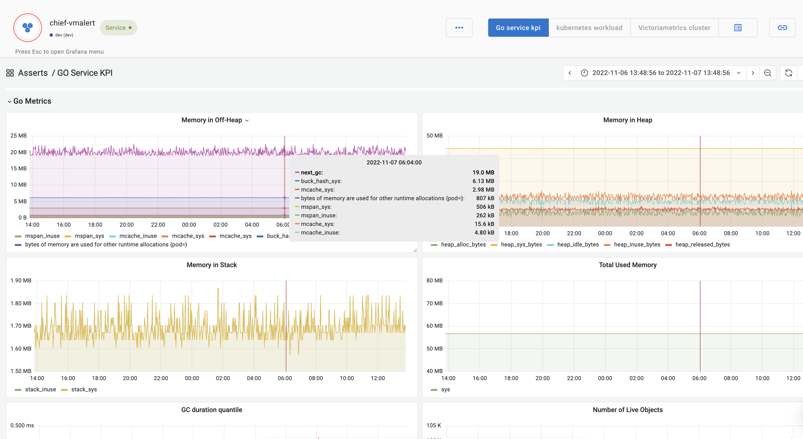

# GoLang

### Setup

For instructions on how to instrument a Go application with Prometheus exporter, please refer to [this page](https://prometheus.io/docs/guides/go-application/)

### Metrics and Key Performance Indicators (KPIs)

| Metric                                                   | KPI                                                                                                                                                                                                                                                          |
| -------------------------------------------------------- | ------------------------------------------------------------------------------------------------------------------------------------------------------------------------------------------------------------------------------------------------------------ |
| **Metric**                                               | **KPI**                                                                                                                                                                                                                                                      |
| Memory `process_resident_memory_bytes`                   | 
Utilization in k8s

<code>process_resident_memory_bytes / kube_node_status_allocatable{resource="memory"}</code>

Utilization in non k8s

<code>process_resident_memory_bytes / node_memory_MemTotal_bytes</code>
                      |
| 
CPU 

<code>process_cpu_seconds_total</code>
 | 
Utilization in k8s

<code>rate(process_cpu_seconds_total[5m]) / kube_pod_container_resource_limits{resource="cpu"}</code>

Utilization in non k8s

<code>rate(process_cpu_seconds_total[5m]) / rate(node_cpu_seconds_total[5m])</code>
 |

### Dashboard

In addition to the above KPIs, the following Go runtime metrics are also visualized in Go KPI Dashboard

#### Memory

1. Heap Memory `go_memstats_heap_alloc_bytes`
2. Off-Heap Memory `go_memstats_mspan_inuse_bytes`
3. Stack Memory `go_memstats_stack_inuse_bytes`
4. Total Memory `go_memstats_sys_bytes`

#### Objects, Allocations, and GC

1. Live Object Count `go_memstats_mallocs_total-go_memstats_frees_total`
2. Object Allocation Rate `rate(go_memstats_mallocs_total`)
3. Memory Allocation Rate `rate(go_memstats_alloc_bytes_total)`
4. GC Duration Quantiles `go_gc_duration_seconds`

#### Go Routines and pointers

1. Number of routines `go_goroutines`
2. Number of pointer dereferences `rate(go_memstats_lookups_total)`

<figure><figcaption>
Go KPI showing Go runtime metrics
</figcaption></figure>

