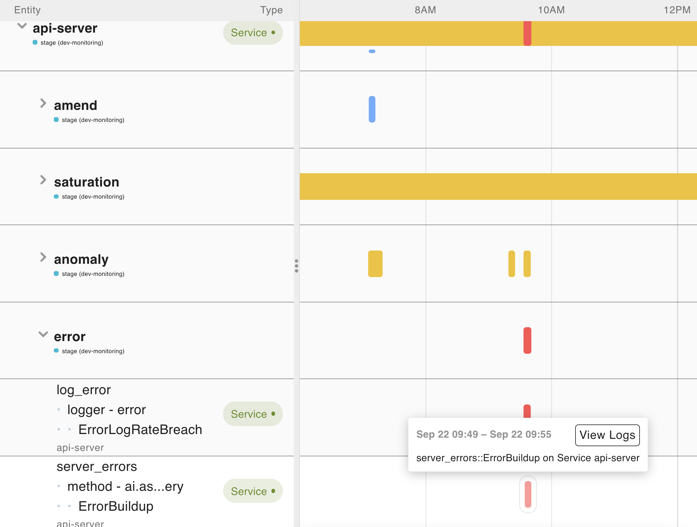
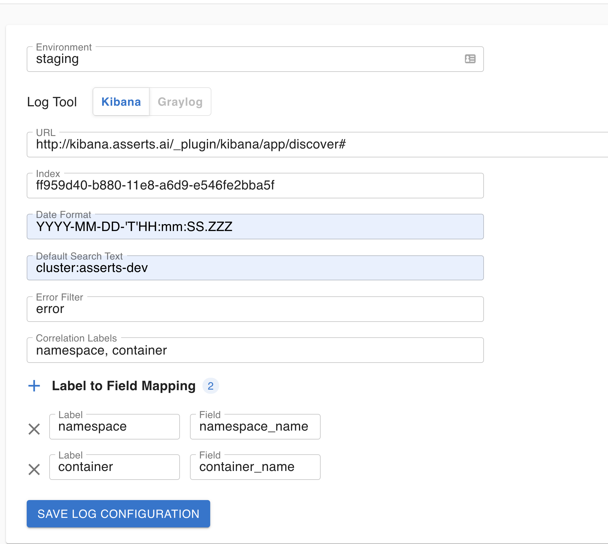
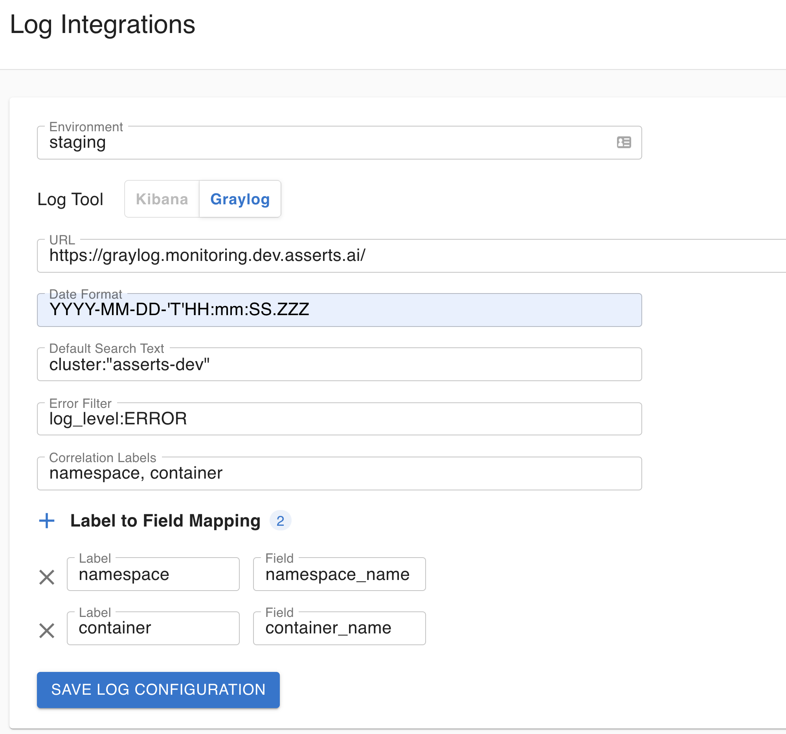

# Integrations

### Log Integration

When doing RCA in the workbench, one can pick a specific time-window when a problem occurred and directly jump to see the logs for that component in that time window.  

Asserts can integrate with any log aggregation tool. Currently log integration is supported for **Kibana** and **Graylog**

### Log Configurations

**Environment** The environment for which this configuration is applicable

**URL** The base URL of the log analytics UI

**Default Search Text** If there is a default search text for this environment. For e.g. _cluster:"asserts-dev"_

**Error Filter**  Search text to identify error messages. For e.g. _log\_level: ERROR._ This will be automatically added when viewing logs for **errors**

**Correlation labels** The set of labels whose values are available as fields in the log message and optionally the mapping of these alert labels to log fields through the **Label to Log Field Mapping**. This is a very powerful feature which enables a precise correlation for the specific component. You can use any field that is present both in the alert and the log message.

**Index** The index id. This is applicable only for **Kibana**

