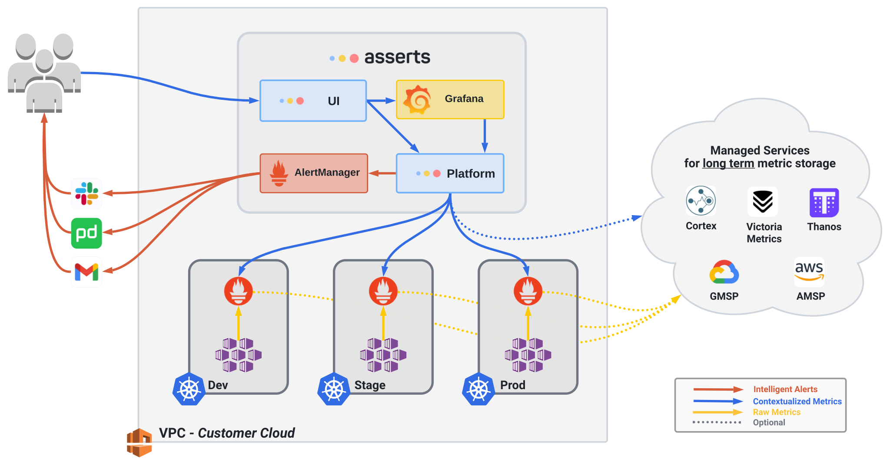

# Self-Hosted

**Asserts** currently runs as a containerized solution.\
How you install Asserts depends on your needs & target environment:

### Installation Options

| Method                              | Target Environment                                                                           |
| ----------------------------------- | -------------------------------------------------------------------------------------------- |
| [Helm Chart](helm-chart.md)         | Kubernetes                                                                                   |
| [Docker Compose](docker-compose.md) | 
Docker Swarm Virtual or Physical Machine    • MacOS   • Windows   • Linux
 |
|                                     |                                                                                              |
