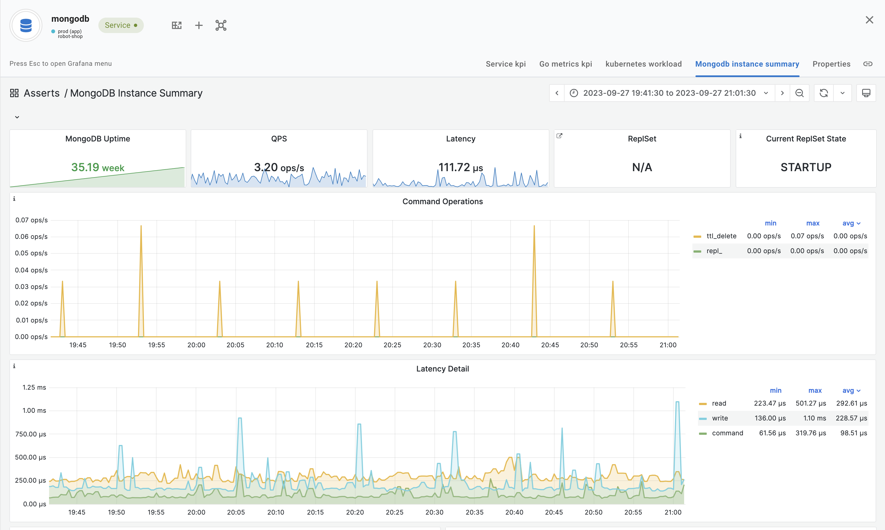

# AWS CloudWatch

Asserts can monitor AWS Services, including Serverless technologies like AWS Lambda and AWS ECS Fargate. The following Asserts components must be installed to start monitoring your AWS Services.

* **Asserts AWS Exporter** installed as an ECS Service.
* **Asserts Layer** for NodeJS and Python AWS Lambda functions. These layers export CPU,  Memory, and other runtime metrics of the Lambda function
* **Asserts ECS Exporter** installed as a sidecar container in each ECS Task definition. This sidecar exports CPU, Memory, and Network metrics for the ECS Task.

Here is a diagram that shows how these components function

<figure><figcaption><p>Asserts Components for AWS Monitoring</p></figcaption></figure>

#### Installing the Asserts AWS Exporter

The Asserts AWS Exporter must be installed on each AWS Account that needs to be monitored. Asserts provides a CloudFormation template to install the exporter. The link, **install AWS Exporter** as shown in the image below **** will launch the CloudFormation template to install the AWS Exporter.

<figure><figcaption><p>Link to launch CloudFormation template for AWS Exporter installation</p></figcaption></figure>


The following inputs would need to be provided -

**VPC and Subnets**

1. **VPC Id** The VPC in which the Asserts AWS Exporter ECS Service needs to be installed.&#x20;
2. **VPC CIDR** The CIDR of the VPC
3. **Subnets** The subnets for the service instances. At least 2 subnets in different availability zones need to be provided

**ECS Cluster and Log Group Settings**

1. **ECS Cluster Name** The ECS Cluster name under which the asserts exporter services will be created. Defaults to **asserts-aws-integration**
2. **Log Group Name** The CloudWatch log group name under which the logs for the services will be **** stored. Defaults to **asserts-aws-integration**
3. **Log Group Retention Period** The log retention. Defaults to **7 days**
4. **Enable Container Insights** This is an ECS Cluster level setting that will determine if ECS resource utilization metrics need to be captured at the container level. This defaults to **enabled**. This has cost implications so if cost is a concern, it can be set to **disabled**

**Asserts TSDB and API Server Credentials**

1. **Asserts Tenant Name** If your asserts application URL is https://acme.app.asserts.ai, your tenant name is **acme**
2. **Asserts Remote Write URL** For e.g. https://acme.tsdb.asserts.ai
3. **Asserts Remote Write Password** The Asserts remote write password
4. **Asserts API Server URL** For e.g. https://acme.app.asserts.ai
5. **Asserts API Server API User Name** An API key can be created in Asserts. In the Asserts product, Go to your Profile -> Settings -> Credentials and create a new credential. Copy the **Id** and **Secret** for use later. Specify the **Id** as the User name
6. **Asserts API Server API Password** Specify the **Secret** as the password
7. **CloudWatch User Password** Password to create a user with permission to read CloudWatch metrics.

<figure><figcaption><p>Create Asserts Service API Credentials</p></figcaption></figure>

The CloudFormation template creates an API key to allow the Asserts server to read CloudWatch metrics from this account.&#x20;

<figure><figcaption><p>CloudFormation output</p></figcaption></figure>

After installing the exporter, add the AWS account along with the API key.

#### Installing Asserts Lambda Layer

Asserts provides Lambda layers for [NodeJS](https://github.com/asserts/asserts-aws-lambda-layer-js) and [Python](https://github.com/asserts/aws-lambda-layer-python) to monitor CPU, Memory, and other runtime aspects. To add these layers to your functions, refer to the README of these GitHub projects.

#### Installing the Asserts ECS sidecar container&#x20;

The ECS sidecar container needs to be included in the task definition of each ECS Task. Here is a sample JSON excerpt of the sidecar container definition that can be added to your existing task definition JSON.

```
{
  "logConfiguration": {
    "logDriver": "awslogs",
    "secretOptions": null,
    "options": {
      "awslogs-group": "<GROUP-NAME>",
      "awslogs-region": "<REGION>",
      "awslogs-stream-prefix": "ecs-dockerstats-exporter"
    }
  },
  "portMappings": [
    {
      "hostPort": 8014,
      "protocol": "tcp",
      "containerPort": 8014
    }
  ],
  "image": "asserts/ecs-dockerstats-exporter:v0.9.0.8",
  "essential": true,
  "name": "ecs-dockerstats-exporter"
}
```
