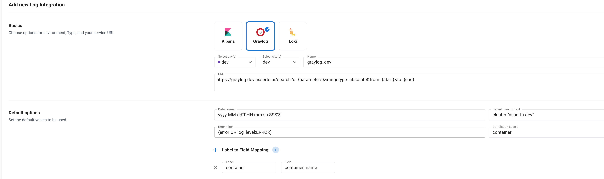

# Logs

When doing RCA in the workbench, one can pick a specific time window when a problem occurred and directly jump to see the logs for that component in that time window. &#x20;

Currently, log integration is supported for **Kibana**, **Graylog,** and **Loki**

## Log Configuration

**Environment** The environment for which the configuration is applicable

**Site** The site for which the configuration is applicable, If not selected applicable for all sites for the environment.

**URL** The base URL of the log analytics UI

**Date Format** The format for start and end time inputs in the search request. This is specified using [Java Date Format](https://docs.oracle.com/javase/7/docs/api/java/text/SimpleDateFormat.html)

**Default Search Text** If there is a default search text for this environment. For e.g. _cluster:"asserts-dev"_

**Error Filter** Search text to identify error messages. For e.g. _log\_level: ERROR._ This will be automatically added when viewing logs for **errors**

**Correlation labels** The set of labels whose values are available as fields in the log message.

**Label to Log Field Mapping (optional)** Optionally, the correlation labels can be mapped to the log fields to enable a precise search of logs related to the component, problem, and time-window.&#x20;

**Index** The index id. This is applicable only for **Kibana**

## Kibana

<figure><figcaption>
Kibana Configuration to a Custom Kibana Service
</figcaption></figure>

## Graylog

<figure><figcaption>
GrayLog Config to a Custom Graylog Service
</figcaption></figure>

## Loki

<figure><figcaption>
Loki Configuration to a Customer Loki Service
</figcaption></figure>

#### Loki Log-Specific Configuration

**Org Id**: Loki Org Id in Grafana

**Data Source**: Loki DataSource name in Grafana

&#x20;
