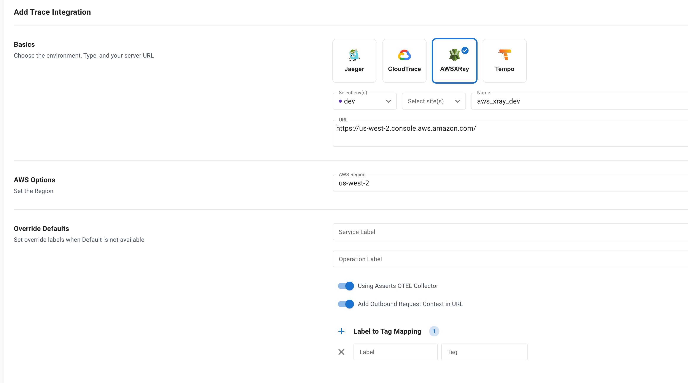

# AWS X-Ray

For Latency Assertions, traces are filtered in AWS X-Ray URL with the duration to focus on problematic Traces to find the RCA if Asserts OTEL Collector is not used.

For Error Assertions, the traces are filtered based on server or client error codes.

**AWS Region** Specify the Region traces ingested.

<figure><figcaption>
AWS XRay Configuration
</figcaption></figure>
