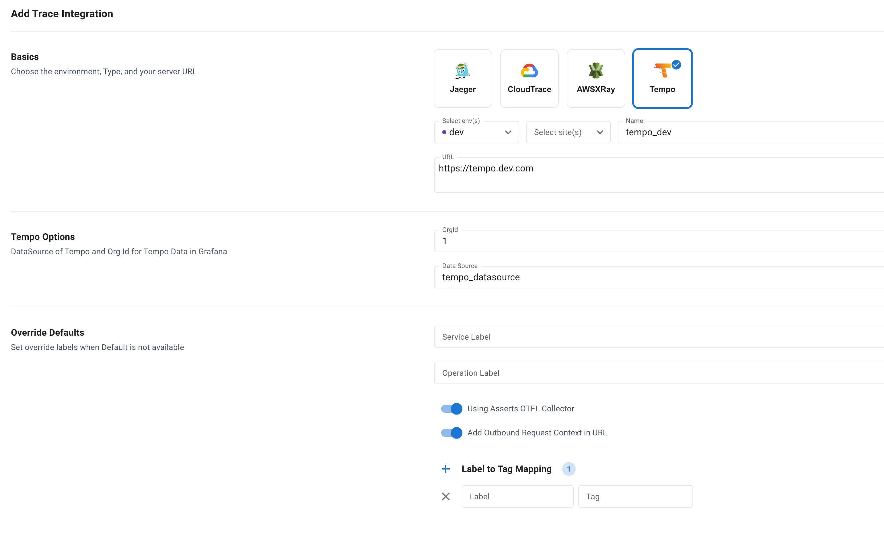

# Grafana Tempo

For Latency Assertions, traces are filtered in Grafana Tempo URL with the duration to focus on problematic Traces to find the RCA if Asserts OTEL Collector is not used.

For Error Assertions, the traces are filtered based on server or client error codes.

**Org Id** Specify the Org Id configured in Grafana for Tempo.

**Data Source** Specify the Data Source configured in Grafana for Tempo.

<figure><figcaption>
Grafana Tempo Configuration to a Customer Tempo Service
</figcaption></figure>
