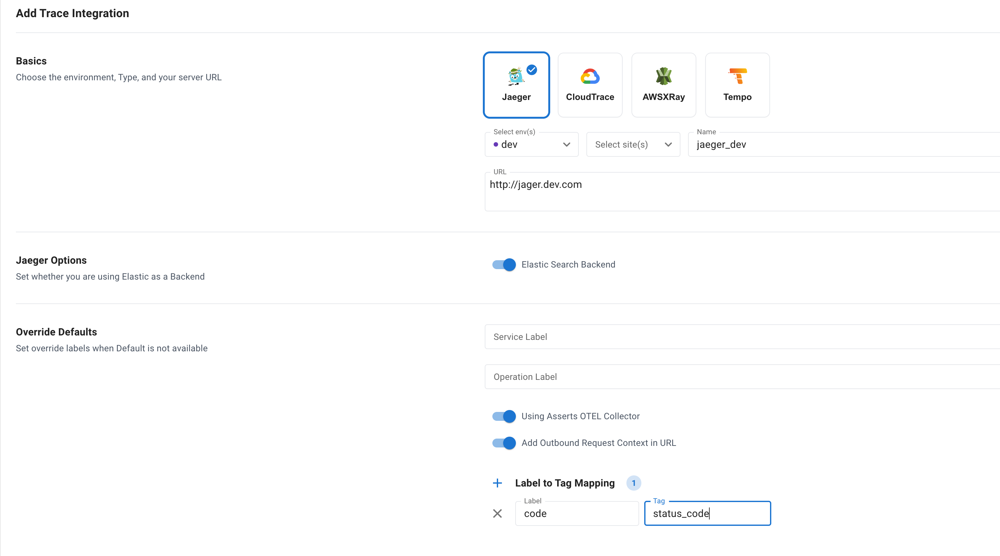

# Jaeger

For Latency Assertions, traces are filtered in Jaeger UI with the duration to focus on problematic Traces to find the RCA if Asserts OTEL Collector is not used.

For Error Assertions, if the backend is Elasticsearch then the traces are filtered based on server or client error codes.

**Elasticsearch Backend** Specify whether Jaeger is using Elasticsearch as the trace storage backend.

<figure><figcaption>
Jaeger Configuration to a Customer Jaeger Service
</figcaption></figure>
