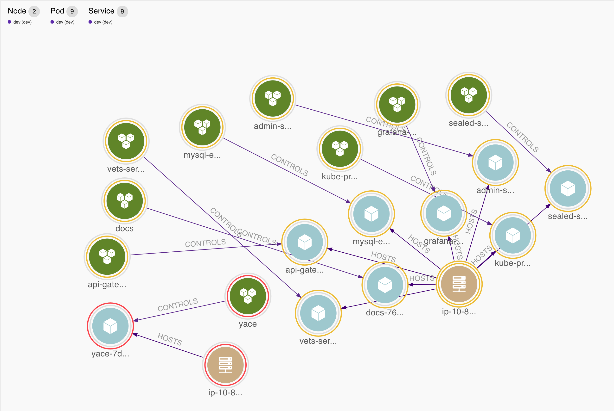
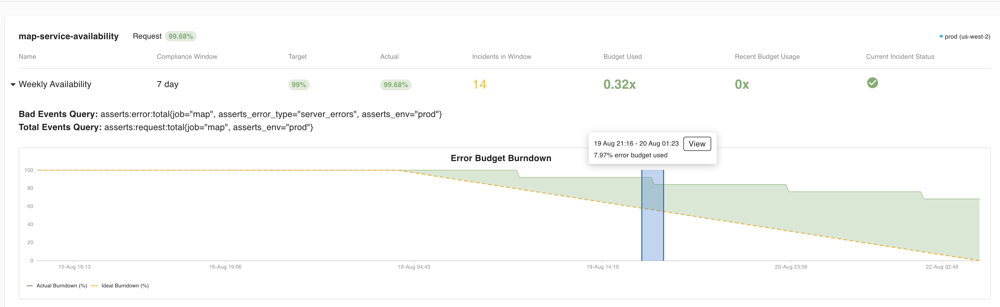
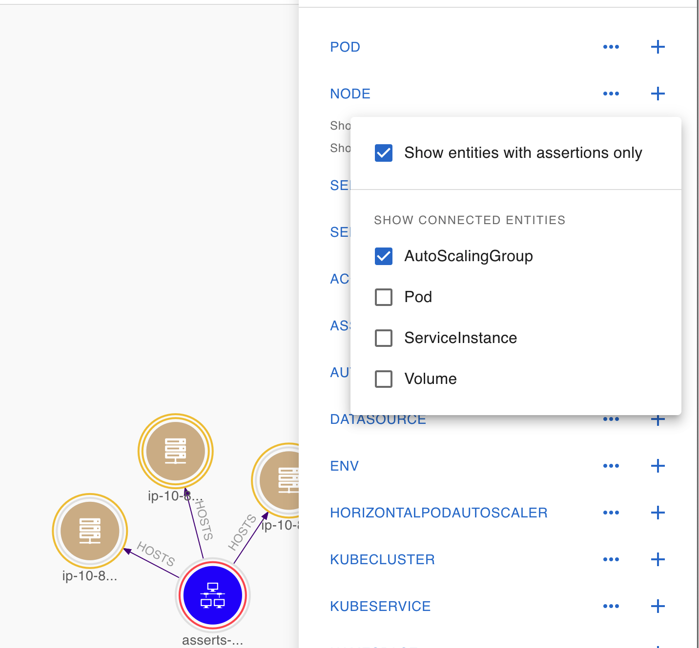
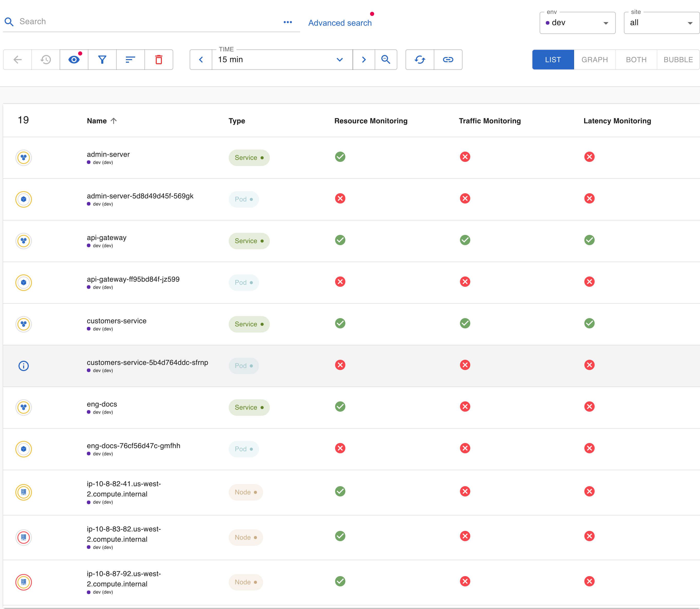
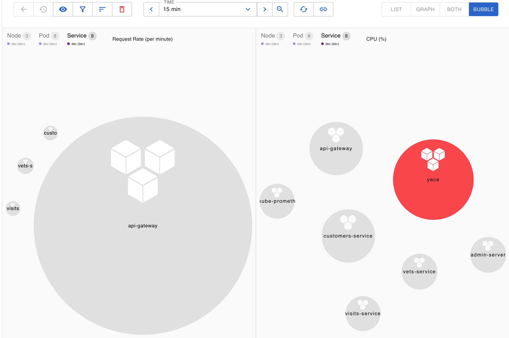
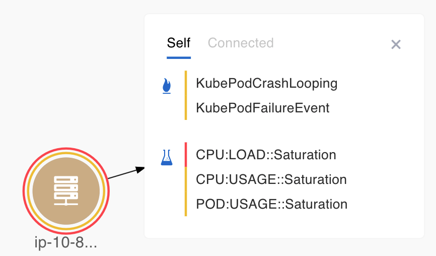
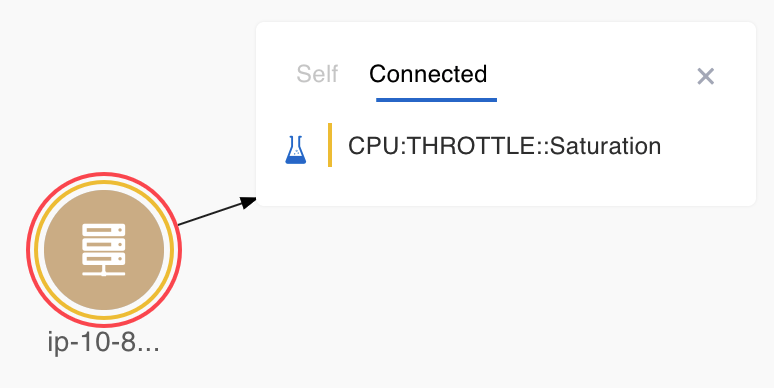
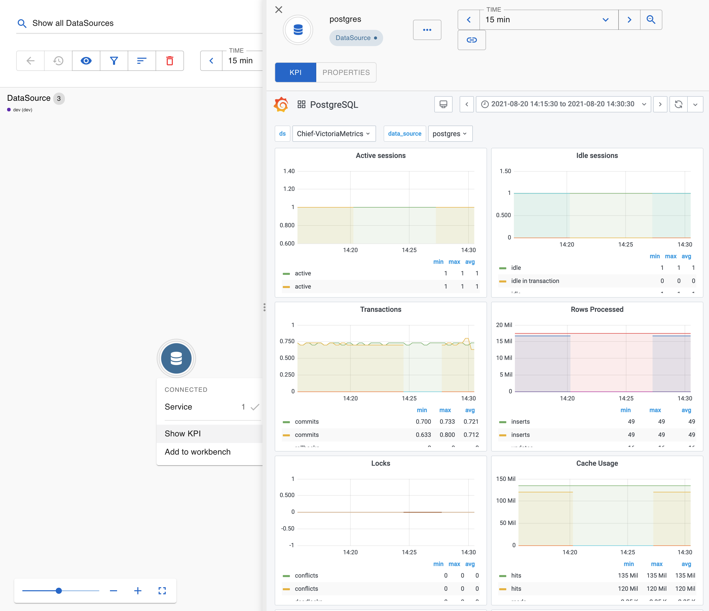
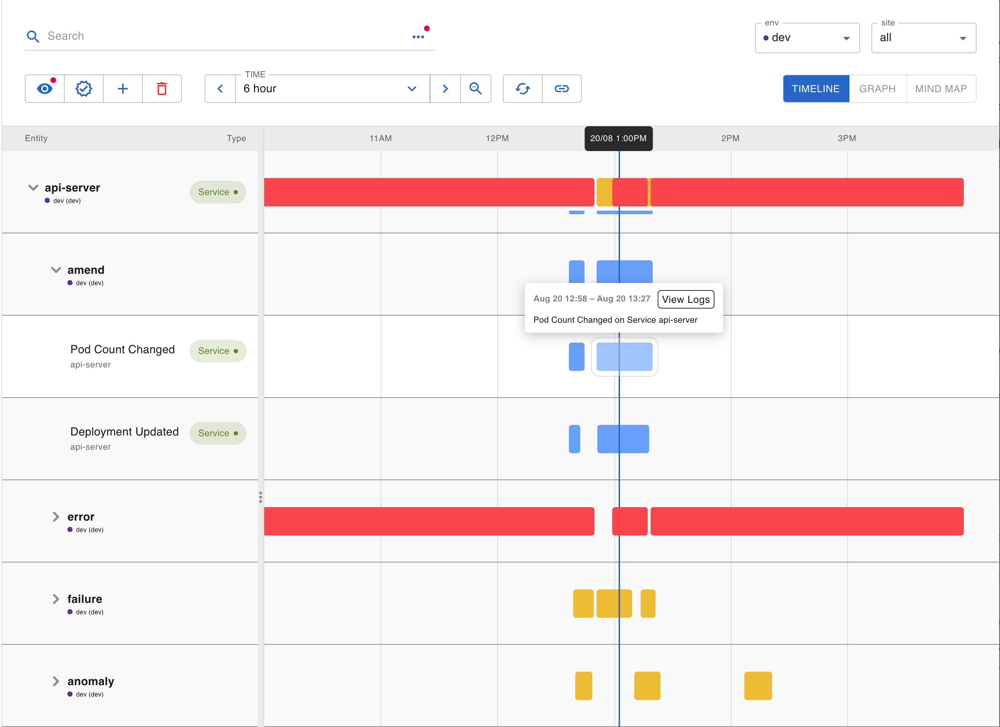
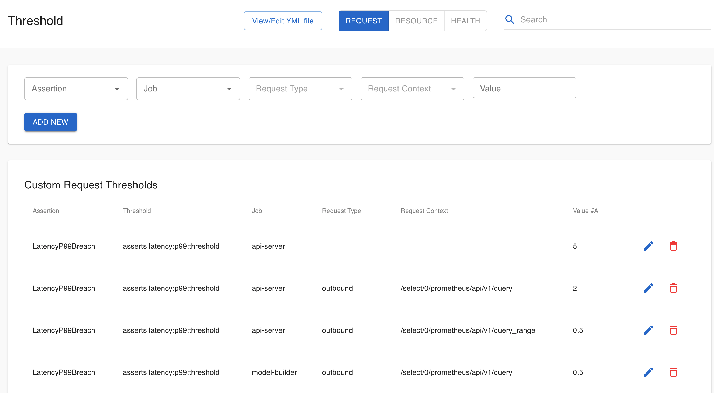

# Product : How Asserts Works \(WIP\)


* [A New Age For Time-Series Data](product-how-asserts-works-wip.md#HowAssertsWorks%28WIP%29-ANewAgeForTime-SeriesData)
* [How Asserts Processes Data](product-how-asserts-works-wip.md#HowAssertsWorks%28WIP%29-HowAssertsProcessesData)
  * [Discovery](product-how-asserts-works-wip.md#HowAssertsWorks%28WIP%29-Discovery)
  * [Normalization](product-how-asserts-works-wip.md#HowAssertsWorks%28WIP%29-Normalization)
  * [Assertion](product-how-asserts-works-wip.md#HowAssertsWorks%28WIP%29-Assertion)
  * [Correlation](product-how-asserts-works-wip.md#HowAssertsWorks%28WIP%29-Correlation)
* [How To Use Asserts](product-how-asserts-works-wip.md#HowAssertsWorks%28WIP%29-HowToUseAsserts)
  * [Check-in](product-how-asserts-works-wip.md#HowAssertsWorks%28WIP%29-Check-in)
    * [Top Insights](product-how-asserts-works-wip.md#HowAssertsWorks%28WIP%29-TopInsights)
    * [SLOs](product-how-asserts-works-wip.md#HowAssertsWorks%28WIP%29-SLOs)
    * [Incidents](product-how-asserts-works-wip.md#HowAssertsWorks%28WIP%29-Incidents)
  * [Exploring the entity graph](product-how-asserts-works-wip.md#HowAssertsWorks%28WIP%29-Exploringtheentitygraph)
    * [Search](product-how-asserts-works-wip.md#HowAssertsWorks%28WIP%29-Search)
    * [Navigation](product-how-asserts-works-wip.md#HowAssertsWorks%28WIP%29-Navigation)
    * [Entity assertion status](product-how-asserts-works-wip.md#HowAssertsWorks%28WIP%29-Entityassertionstatus)
    * [Dashboards](product-how-asserts-works-wip.md#HowAssertsWorks%28WIP%29-Dashboards)
  * [RCA with the Workbench](product-how-asserts-works-wip.md#HowAssertsWorks%28WIP%29-RCAwiththeWorkbench)
  * [Assertion Management](product-how-asserts-works-wip.md#HowAssertsWorks%28WIP%29-AssertionManagement)
    * [Thresholds](product-how-asserts-works-wip.md#HowAssertsWorks%28WIP%29-Thresholds)
    * [Notifications](product-how-asserts-works-wip.md#HowAssertsWorks%28WIP%29-Notifications)
    * [Suppressions](product-how-asserts-works-wip.md#HowAssertsWorks%28WIP%29-Suppressions)
    * [Additions](product-how-asserts-works-wip.md#HowAssertsWorks%28WIP%29-Additions)
* [Integrations](product-how-asserts-works-wip.md#HowAssertsWorks%28WIP%29-Integrations)

## A New Age For Time-Series Data <a id="HowAssertsWorks(WIP)-ANewAgeForTime-SeriesData"></a>

In the land of observability, time-series data, aka metrics, have played a central role. Traditional monitoring products capitalize on their collection and analysis but keep their format as a proprietary implementation detail. Then the need for interoperability comes along. In the cloud-native world, open-source approaches like [Prometheus](https://prometheus.io/) have gained wide adoption. [Off-the-shelf metric exporters](https://prometheus.io/docs/instrumenting/exporters/) flourished. Developers build their software with metric-publishing a built-in. This changed the ecosystem. How to collect data is much less the focus than how to consume them.

Combing through the ocean of metrics can be a daunting task. PromQL helps, but it requires its user to have deep domain knowledge of the time series data itself. Dashboards help too, but they need considerable human effort to keep up with constant-changing software systems rolled out from a CI/CD pipeline.

Asserts positions itself as a new way to look at time-series data, to automatically bridge the gap between machine-generated data and human understanding of the system. Our key observation is that these metrics have embedded sufficient contextual information within themselves. All we need is to tap into a system’s metrics stream, and we can discover all the underlying infrastructure and application entities like Nodes, Pods, Services, with which we can better utilize the time-series data

* we can automatically group metrics together in curated dashboards
* we have the right context to assert what’s going on for certain performance problems
* we can leverage their relationships to further assert the correlation/causality between things
* we can propagate and rank these assertions and surface the most important insights

## How Asserts Processes Data <a id="HowAssertsWorks(WIP)-HowAssertsProcessesData"></a>

As an Asserts customer, all you need to do is to forward your Prometheus metrics to Asserts. This can be done with a simple remote write config. Once the metrics are in Asserts land, a few things happen.

### Discovery <a id="HowAssertsWorks(WIP)-Discovery"></a>

First, we inspect their labels to discover various entities and populate their properties. In addition, we deduce the relationships between them by matching their properties or matching against certain metrics that directly establish relations. As a result, we can determine which pod is hosted on which node, which pods form a service, and how services call each other.

All these entities, properties, and relationships form a knowledge graph that describes our understanding of the system. They are also indexed to be easily searchable. The discovery process constantly updates the graph while at the same time keeps the history.

TODO: a better entity graph, or perhaps a GIF? I moved the GIF to Navigation section below

### Normalization <a id="HowAssertsWorks(WIP)-Normalization"></a>

Secondly, Asserts has curated a set of rules to normalize the incoming heterogeneous time series into a set of essential metrics, like RED metrics \(Request, Error, Duration\) for application components, and utilization metrics for infrastructure components.

For example, the RED metrics from Springboot will be recorded as Prometheus counter `asserts:request:total`, `asserts:latency:total`, and `asserts:error:total`

```text
- record: asserts:request:total
  expr: http_server_requests_seconds_count
  labels:
    asserts_request_type: inbound
    asserts_source: spring_boot

- record: asserts:latency:total
  expr: http_server_requests_seconds_sum
  labels:
    asserts_request_type: inbound
    asserts_source: spring_boot

- record: asserts:error:total
  expr: http_client_requests_seconds_count{status=~"5.."}
  labels:
    asserts_request_type: outbound
    asserts_error_type: server_errors
    asserts_source: spring_boot
```

We add labels like `asserts_request_type`, `asserts_error_type`, etc., to indicate the level of granularity for further processing in instrumentation. Some more dynamic context information like HTTP paths will be recorded in `asserts_request_context` with Prometheus relabelling rule at ingestion time.

If a customer has metrics from multiple environments \(dev, stage, prod\), or multiple sites \(region, data center, etc\), he/she can use a combination of external labels and relabeling rules to add `asserts_env` and `asserts_site` labels to scope metrics and thus entities discovered from them. Asserts provides `env` and `site` dropdown filters in the Web App to segment the graph into different environments and sites, while at the same time still keep everything in a single graph to facilitate cross-environment/site correlation or comparison.

### Assertion <a id="HowAssertsWorks(WIP)-Assertion"></a>

We then apply our extensive domain knowledge to instrument these normalized metrics. Out-of-box we automatically instrument application frameworks like Springboot, Flask, Loopback, etc, infrastructure components like Kubernetes resources, 3rd party services like Redis server, Kafka cluster, and many more.

With instrumentation in place, we form a SAAFE model to capture events as what we call “_assertions_”

* **S**aturation indicates whether a resource \(CPU, Memory, etc\) is saturated
* **A**mend captures changes in the system, like deployment, scaling, config map change, etc.
* **A**nomaly captures abnormal shifts in request rate, latency, or resource consumption
* **F**ailure records failure state in the system, like primary-standby sync failure, pod crash looping, etc.
* **E**rror records problematic requests, i.e, 500x, 400x, or breaches of latency thresholds, etc.

Assertions thus become condensed time-series data that only capture important events in the system. They bear Assert’s deep knowledge on the observability of various building blocks in a modern application.

Assertions are different from traditional alerts, as they are not meant to be used to notify on-call personnel. They are more like vital signs surfaced automatically by Asserts, and ready to be used in troubleshooting. Sure enough, customers can choose to subscribe to selected assertions and fulfill their role as traditional alerts.

### Correlation <a id="HowAssertsWorks(WIP)-Correlation"></a>

Asserts’s story doesn’t stop with automatic instrumentation. Once assertions arise, we do a few more things

* we attach them back to the graph. This, when combined with indexing, provides a powerful way to navigate both entities and their health status in the graph
* we enrich the assertions with context information from the graph. For example, an assertion that happened on a pod can be tagged back to the node and service the pod belongs to. This allows assertions that happened on ephemeral entities \(pods\) to bubble up to long-lived entities \(nodes, services\), thus forming an aggregated view with a continuous timeline.

Since assertions are condensed and contextualized, they are much faster to query and aggregate, much easier to correlate or rank, thus enabling quick and precise root cause analysis.

## How To Use Asserts <a id="HowAssertsWorks(WIP)-HowToUseAsserts"></a>

### Check-in <a id="HowAssertsWorks(WIP)-Check-in"></a>

#### Top Insights <a id="HowAssertsWorks(WIP)-TopInsights"></a>

Assertions enable us to quantify the overall health of the system. We represent that as top insights on the default landing page.

Here we rank services by their weighted assertion score and present a thumbnail sketch of all the assertions in the system. This helps surface the hot spot in the system so a user can jump right in.

#### SLOs <a id="HowAssertsWorks(WIP)-SLOs"></a>

For a more hands-on approach, users can define SLOs based on our normalized metrics or their own metrics. For example, an SLO specification can be defined like the following and posted to our API endpoint or through our configuration UI.

```text
apiVersion: asserts/v1
kind: SLO
name: api-server-availability
indicator:
  kind: Request
  badEventCount: asserts:error:total{job="api-server", asserts_error_type="server_errors"}
  totalEventCount: asserts:request:total{job="api-server"}
entitySearch: "show service api-server"
objectives:
  - ratio: 0.99
    name: "Weekly Availability"
    window:
      kind: Rolling
      days: 7
```

Unlike assertions, SLOs are meant for capturing high-level business objectives. The specification is designed to be declarative. Asserts takes care of how it is actually tracked and integrated into our assertion and alerting framework. The web app provides a list view of all the SLOs, along with their status, and the burndown chart of the error budget.

TODO: find a better chart that has better burn-down details



#### Incidents <a id="HowAssertsWorks(WIP)-Incidents"></a>

We assume the user wants to be notified whenever an SLO is violated, so we list each violation on the Incidents page. Assertions, on the other hand, are not necessarily incidents. A user can choose to treat certain assertions as incidents by enabling notifications on them.

These incidents are grouped by SLOs and assertions and laid out in a common time frame. This is very similar to our WorkBench to help users instantly spot time-based correlation.

### Exploring the entity graph <a id="HowAssertsWorks(WIP)-Exploringtheentitygraph"></a>

#### Search <a id="HowAssertsWorks(WIP)-Search"></a>

Asserts’s web app is built for cloud-scale. The best way to explore the entity graph is to use search expressions. We’ve shipped a default set of search expressions that cover common use cases. For example “Show all services”, “Show Assertions in Namespace”, etc.

“Advanced search” panel provides more advanced search functions like search by property conditions, show connected entities, etc. These searches can provide context-rich shortcuts to a group of entities that a user wants to look at as a whole.

Keep in mind that the graph is constantly updated by the time-series data, so the search result represents the system's state in the specified time window. When you change the time, the search result may change too. In addition, search results are always filtered by the selection in `env` and `site` dropdown.

#### Navigation <a id="HowAssertsWorks(WIP)-Navigation"></a>

When a user clicks on an entity, it also allows the user to navigate to its connected entities. Navigation can be done in both graph view and list view. If the graph gets busy, we can filter the displayed entities by clicking on the entity type in the legends.

The list view also contains the monitoring status of each entity. This gives a high-level overview of what’s being automatically monitored by Asserts. Resource monitoring applies to both Services and Nodes, but traffic and latency monitoring usually only applies to Services.

A bubble view is also provided to help the user to rank entities by requests, resources, or selected property. The user can even select multiple fields to rank them in the same view. For example, the following rank services by both requests and CPU. The node color indicates the assertion status related to the selected field. Thus `yace` service here is having a CPU-related assertion.

#### Entity assertion status <a id="HowAssertsWorks(WIP)-Entityassertionstatus"></a>

For each entity, two color-coded rings indicate the assertion status of the entity

* The outer ring indicates the status of the entity itself
* The inner ring indicates the status of all the lower-level entities contained within itself

The inner ring helps because, for ephemeral entities like Pods, their containing entity like Nodes or Services are usually more applicable for being focal points for analysis. Thus seeing a colored inner ring on the node/service itself is useful.

Red highlights CRITICAL, Yellow indicates WARNING, and Blue is for INFO. As a rule of thumb, _Saturation_ can be either CRITICAL or WARNING, _Failure_s are usually CRITICAL, _Anomalies_ are usually _WARNING_, and _Amends_ are usually INFO.

The following example shows a node that has a critical CPU load on itself, while at the same time, one of the pods hosted on it is experiencing CPU Throttle.

TODO: we are merging the two tabs into one, so need to get a new screenshot later. See [CH ticket](https://app.clubhouse.io/asserts/story/7506/failure-assertions-show-up-in-self-instead-of-connected)

|  |  |
| :--- | :--- |


#### Dashboards <a id="HowAssertsWorks(WIP)-Dashboards"></a>

A user can pull up the KPI dashboard for each entity in focus by clicking “Show KPI”. Asserts has curated a library of Grafana dashboards. Each entity type has its own dashboard, so we have a dashboard for Nodes and Services. Within the same entity type, say Service, if we know the service type, say Redis, we have a specific dashboard for that service type.

Asserts keeps working on expanding this library. If a customer has their own dashboards, he/she can also integrate them into Asserts Web App.

### RCA with the Workbench <a id="HowAssertsWorks(WIP)-RCAwiththeWorkbench"></a>

The traditional way of troubleshooting usually involves pulling out a few dashboards, open a metrics browser and add a few metrics, and perhaps open a few more browser windows for logs and other things. Quite often you realize the dashboards are out-of-date, or you don’t know which metrics to pull, or it takes you 5 minutes just trying to zoom into the time range to focus on. The list of annoyance can be quite long.

Asserts has automatically surfaced all the assertions in the system, and enriched them with all the context. At times, just a glance over top insights, or a search into the graph can reveal what’s going on. For more hands-on troubleshooting, we build a Workbench for manually analyzing assertions.

The workflow for the Workbench is similar to a pinboard. Whether a user is just glancing through top insights or incidents, or exploring the entities in the graph, there is always a pin button “+” or “Add” to add entities, assertions, or the result of a search expression to the Workbench. Once they are in the Workbench, they are laid out in a common time frame, so if there is any causality in between, it will pop up right in front of you.

The search box also works for the Workbench, so a user can quickly add more entities to the Workbench for root cause analysis. We also integrate with logging systems to help the user quickly jump into the logs with the time range pre-populated.

The timeline view is not the only view option. A user can also choose the graph view to evaluate the impact of the current issues and spot spatial correlation on the graph.

Mindmap view provides a way to walk down the assertions by categories and assertion types, instead of by entities. This view helps to spot the common problem across many different entities.

### Assertion Management <a id="HowAssertsWorks(WIP)-AssertionManagement"></a>

#### Thresholds <a id="HowAssertsWorks(WIP)-Thresholds"></a>

Asserts has curated an assertion library pertaining to our SAAFE model. Internally they are a collection of Prometheus rules with user-configurable thresholds. We divide the threshold configuration into three sections and organize each section by assertion types

* **Request** is about rate, latency, and error assertions
  * Each **Anomaly** is checked against a dynamic range that combines standard deviation and percentage deviation. Daily and weekly seasonalities are considered. A sparseness check is also put in place to reduce noise on sparse requests.
  * Each **Breach** is checked against a static threshold. **ErrorLogSpike** is also a breach assertion
  * Client **Errors** are treated as anomalies so follow the anomaly algorithms mentioned above
  * Server **Errors** are tracked with an error budget approach, so are controlled by fast burn or slow burn factors
* **Resource** section is about CPU, Memory, Disk, Network, etc
  * Each **Saturation** works with two static thresholds, one for warning and one for critical
  * Some resources like disk have rate metrics \(bytes read/write\), so we have **ResourceRateAnomaly** and **ResourceRateBreach** assertions. They follow the same approach as their request counterparts
* **Health** section is mostly about all the failure assertions in various domains. We organize the domain rules by groups. Within each group, the user can edit each individual rule.

Besides the configuration for all the default thresholds, the user can also configure individual thresholds on fine-grained levels. These levels are hierarchical. For requests, if you specify a threshold on `job` level, it applies to all the request types for that job. Similarly, if you specify a threshold on `request_type` level, it applies to all the request contexts for that request type and job.

For resources, the hierarchy starts with `source`, i.e., the exporter, then `resource_type,` and then `container`. An additional dimension is `severity`, which is independent of the granularity levels.

#### Notifications <a id="HowAssertsWorks(WIP)-Notifications"></a>

As we mentioned earlier, assertions are not alerts. If you want to get notified, you can add notification rules. They are also organized into the same three sections like the thresholds, and the same hierarchical granularity levels apply. You can set notifications for an assertion whenever it fires, or when it fires on a certain job, or a certain job and request type. Free-form label conditions are also supported here.

#### Suppressions <a id="HowAssertsWorks(WIP)-Suppressions"></a>

Similar to notifications, you can also choose a subset of assertions to suppress, so they don’t even fire. Suppressed assertions are ignored in Asserts processing. They will not be available in Top Insights, Graph, or the Workbench. Note this is very different from an assertion that fires but does not notify.

#### Additions <a id="HowAssertsWorks(WIP)-Additions"></a>

If you have your own set of rules, you can also bring them into the Asserts system by defining custom assertion rules. You can either add them one by one on the UI or upload a rule file.

TODO: This screen looks like WIP

## Integrations <a id="HowAssertsWorks(WIP)-Integrations"></a>

TODO: WIP

Logging

Custom Dashboards

Sentry?

