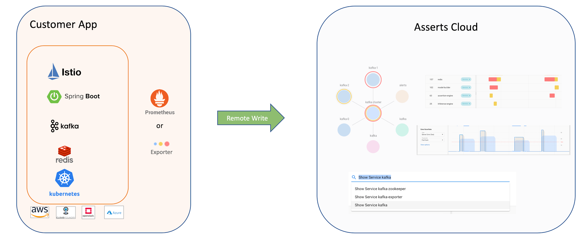
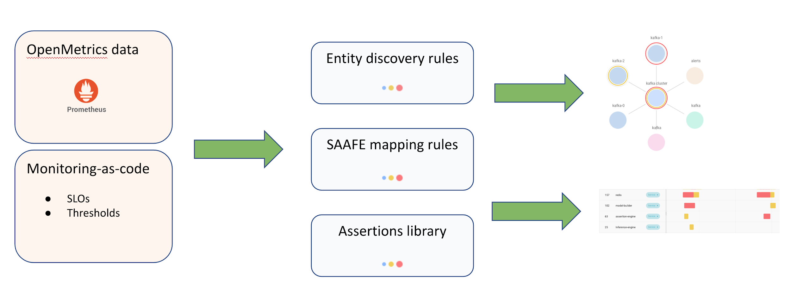

# Getting Started

Asserts is cloud-agnostic and has no proprietary application agents to install. It is natively built on the open [Prometheus](https://prometheus.io/) ecosystem with 100s of [exporters](https://prometheus.io/docs/instrumenting/exporters/).

You can get started by adding _remote-write_ to Asserts cloud in your _prometheus.yml_



## **Remote Write**

Here’s an example Prometheus remote write configuration:

```yaml
remote_write:
 - url: https://your-tenant-name.tsdb.asserts.ai/insert/0/prometheus/
   basic_auth:
   username: your-tenant-name
   password: <secret>
   queue_config:
   capacity: 10000
   max_samples_per_send: 10000
   max_shards: 10
```

Asserts will provide your tenant name and password, used in the configuration above, during onboarding.

### Filtering with Relabeling

Sometimes it’s desirable to only remote write some metrics. You can add a write\_relabel\_configs section to do this:

```yaml
remote_write:
- url: https://your-tenant-name.tsdb.asserts.ai/insert/0/prometheus/
  basic_auth:
  username: your-tenant-name
  password: <secret>
  write_relabel_configs:
- source_labels: [namespace] # keep all metrics in the dev namespace
  regex: dev
  target_label: __tmp_keep
  replacement: 'true'
- source_labels: [created_by_kind] # drop all metrics with label name -> created_by_kind=Job
  regex: Job
  action: drop
- source_labels: [__name__] # keep all metrics matching the various metrics names (this will include those outside the dev namespace)
  regex: node_.*|kubelet_.*|kube_node_.*|prometheus_.*|alertmanager_.*
  target_label: __tmp_keep
  replacement: 'true'
- source_labels: [__tmp_keep] # keep all the metrics with the label __tmp_keep=true
  regex: 'true'
  action: keep
- regex: __tmp_keep # drop all the __tmp_keep labels (not the metric)
  action: labeldrop
  queue_config:
  capacity: 10000
  max_samples_per_send: 10000
  max_shards: 10
```

## Monitoring as a code

Manage your SLOs and Thresholds as code and publish them to Asserts cloud



### SLO

Here is an example SLO that we use to monitor Asserts itself. The service level indicator defined here measures how long a recurring task that updates the Asserts graph takes to run, and the objective is to keep that run time under 15 seconds 99% of the time.

```yaml
apiVersion: asserts/v1
kind: SLO
name: graph-freshness
indicator:
  kind: Occurrence
  measurement: asserts:latency:p99{job="model-builder", asserts_request_type="method",  asserts_request_context="ai.asserts.model.builder.tasks.ModelBuildingTimerTask#run"}
entitySearch: "show service model-builder"
objectives:
  - value: 15
    ratio: 0.99
    name: "Graph refreshed in time"
    window:
      kind: Rolling
      days: 7
```

Here’s another SLO example. This one checks that the Asserts API server responds successfully to 99.5% of the requests it receives:

```yaml
apiVersion: asserts/v1
kind: SLO
name: api-server-availability
indicator:
  kind: Request
  badEventCount: asserts:error:total{job="api-server", asserts_error_type="server_errors"}
  totalEventCount: asserts:request:total{job="api-server"}
entitySearch: "show service api-server"
objectives:
  - ratio: 0.995
    name: "Weekly Availability"
    window:
      kind: Rolling
      days: 7
```

These examples demonstrate the two kinds of SLOs that Asserts supports:

* Occurrence SLOs are based on time and evaluated each minute. Based on the application’s performance during a minute, that minute is deemed either good or bad. Bad minutes are counted against the SLO’s error budget. Typical use cases for occurrence SLOs are latency and throughput goals.
* Request SLOs are based on events that are either good or bad. Bad events count against the SLO’s error budget. Web application availability is a common use case for a request SLO, where each request received counts as an event, and requests that fail due to server errors count as bad events.

### Threshold

You can control how assertions are generated by tuning thresholds. This rule sets the latency threshold for login requests for a specific customer:

```yaml
- record: asserts:latency:p99:request_context_threshold
  expr: 1
  labels:
   namespace: webapps
   job: auth
   asserts_request_type: inbound
   asserts_request_context: /login
   asserts_customer: acme
```

This rule raises a warning level assertion when a redis node has used more than 70% of its CPU:

```yaml
- record:asserts:resource:warning
  expr: 0.7
  labels:
   asserts_resource_type: cpu:usage
   asserts_component: redis
   asserts_severity: warning
```

