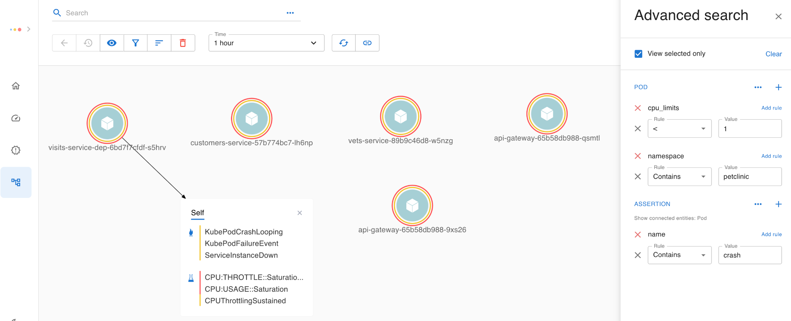
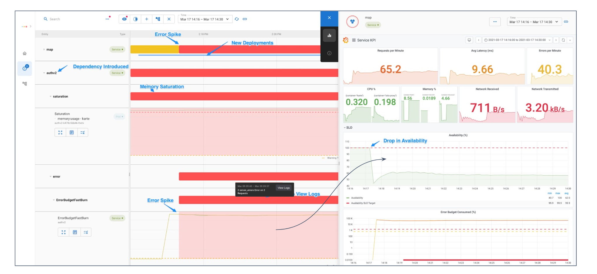

# Asserts Intro Share

## **Founding Story**

As builders and operators of cloud applications and founding engineers of industry-leading APM products at AppDynamics, we were pinched every day; why was it still so hard to troubleshoot and optimize our app with the modern APM tools? We had assertions for our compile time with Unit, Component, and Integration tests but couldn’t apply the same rigor to our runtime. There wasn’t a platform where we could _transcribe our system design_ embedded in golden signals and health metrics into Runtime Assertions. When we started creating Alerts to track these failures and dashboards to view the metrics, they were disjoint, too many to manage, and too noisy to correlate, and will go out of date too soon with our continuous release.

As engineers, we wished for a solution that was adaptive and purposefully built for _distributed systems and cloud architecture_, and most importantly, allow us to manage our _Monitoring as a Code_.

**What is Asserts?**

Asserts is the next-generation insights for your distributed, multi-cloud, hybrid applications.

With Asserts, your team can say goodbye to dashboards that are disjointed and don’t keep up with rapid releases. Your expert engineers won’t be constantly interrupted to pour over esoteric squiggly metric charts and regex stacks of logs to find the needle\(in the haystack\). And to top it off, your on-call team won’t be fatigued by alerts that don’t matter.

Let’s dig deeper to find how Asserts is different.

## **Features**

### **Discover a Living Map of App and Infra components**

Asserts taps into your telemetry data sources \(app metrics\), automatically builds a graph of your application and infrastructure components, and indexes the graph for search.

* With our search, you can find how the components fit together in real-time and view KPIs in the built-in Grafana dashboard.

* Our cloud component catalog is constantly evolving.

### Instrument **via SAAFE Assertions to collect the symptoms and causes**

Asserts curates knowledge of common runtime failure patterns and potential causes, so your team doesn’t have to research and maintain these rules.

· It continuously tracks resource _**Saturation**_, _**Amends**_ \(new deployments, scale events et al.\), request & latency _**Anomalies**_, systemic _**Failures**_, and _**Errors**_ on your [_golden signals_](https://sre.google/sre-book/monitoring-distributed-systems/) and health metrics.

· The occurrences of these assertions are annotated on the \(Knowledge\) Graph, so it is easy to consume at a glance

#### 

### **Explore with Unified Search**

With our unified search, you can combine components, relations, configurations, and associated assertions to express your intent in an easy natural language expression.

· _e.g.,_ Search “pods with cpu limits crashing” 

### 

### **Troubleshoot in Workbench with all the Assertions**

You can use the same search expression in our workbench and jump right in to view all the assertions correlated across time and space, with just the right metrics at your fingertip.

· _e.g.,_ an amend \(new deployment\) triggered a spike in error rate caused by a memory saturation. Click \`View Logs\` to see contextual logs in your existing log store.  

## **Releasing Soon**

### **Wake up when it matters**

The SRE book recommends [Alerting on SLOs](https://sre.google/workbook/alerting-on-slos/), and with Asserts setting up your SLOs and tracking them is a breeze. And then finding the symptoms is just a click away in our workbench.

### **Never miss a beat with TopInsights**

With Asserts always on Assertions, you don’t have to wait for SLOs to breach. Top Insights presents a stack-ranked view of Services and Nodes that need attention based on their _assertion score_.

## **How to get started?**

Asserts is cloud-agnostic and has no proprietary application agents to install. It is natively built on the open [Prometheus](https://prometheus.io/) ecosystem with 100s of [exporters](https://prometheus.io/docs/instrumenting/exporters/).

You can get started by adding _remote-write_ to Asserts cloud in your _prometheus.yml_

### **Remote Write**

Here’s an example Prometheus remote write configuration:

remote\_write:

- url: [https://your-tenant-name.tsdb.asserts.ai/insert/0/prometheus/](https://your-tenant-name.tsdb.asserts.ai/insert/0/prometheus/)

 basic\_auth:

 username: your-tenant-name

 password: &lt;secret&gt;

 queue\_config:

 capacity: 10000

 max\_samples\_per\_send: 10000

 max\_shards: 10

Asserts will provide your tenant name and password, used in the configuration above, during onboarding.

#### 

#### Filtering with Relabeling

Sometimes it’s desirable to only remote write some metrics. You can add a write\_relabel\_configs section to do this:

remote\_write:

- url: [https://your-tenant-name.tsdb.asserts.ai/insert/0/prometheus/](https://your-tenant-name.tsdb.asserts.ai/insert/0/prometheus/)

 basic\_auth:

 username: your-tenant-name

 password: &lt;secret&gt;

 write\_relabel\_configs:

 - source\_labels: \[namespace\] \# keep all metrics in the dev namespace

 regex: dev

 target\_label: \_\_tmp\_keep

 replacement: 'true'

 - source\_labels: \[created\_by\_kind\] \# drop all metrics with label name -&gt; created\_by\_kind=Job

 regex: Job

 action: drop

 - source\_labels: \[\_\_name\_\_\] \# keep all metrics matching the various metrics names \(this will include those outside the dev namespace\)

 regex: node\_.\*\|kubelet\_.\*\|kube\_node\_.\*\|prometheus\_.\*\|alertmanager\_.\*

 target\_label: \_\_tmp\_keep

 replacement: 'true'

 - source\_labels: \[\_\_tmp\_keep\] \# keep all the metrics with the label \_\_tmp\_keep=true

 regex: 'true'

 action: keep

 - regex: \_\_tmp\_keep \# drop all the \_\_tmp\_keep labels \(not the metric\)

 action: labeldrop

 queue\_config:

 capacity: 10000

 max\_samples\_per\_send: 10000

 max\_shards: 10

### Monitoring as a code

Manage your SLOs and Thresholds as code and publish them to Asserts cloud 

#### SLO

Here is an example SLO that we use to monitor Asserts itself. The service level indicator defined here measures how long a recurring task that updates the Asserts graph takes to run, and the objective is to keep that run time under 15 seconds 99% of the time.

apiVersion: asserts/v1

kind: SLO

name: graph-freshness

indicator:

 kind: Occurrence

 measurement: asserts:latency:p99{job="model-builder", asserts\_request\_type="method", asserts\_request\_context="ai.asserts.model.builder.tasks.ModelBuildingTimerTask\#run"}

entitySearch: "show service model-builder"

objectives:

 - value: 15

 ratio: 0.99

 name: "Graph refreshed in time"

 window:

 kind: Rolling

 days: 7

Here’s another SLO example. This one checks that the Asserts API server responds successfully to 99.5% of the requests it receives:

apiVersion: asserts/v1

kind: SLO

name: api-server-availability

indicator:

 kind: Request

 badEventCount: asserts:error:total{job="api-server", asserts\_error\_type="server\_errors"}

 totalEventCount: asserts:request:total{job="api-server"}

entitySearch: "show service api-server"

objectives:

 - ratio: 0.995

 name: "Weekly Availability"

 window:

 kind: Rolling

 days: 7

These examples demonstrate the two kinds of SLOs that Asserts supports:

* Occurrence SLOs are based on time and evaluated each minute. Based on the application’s performance during a minute, that minute is deemed either good or bad. Bad minutes are counted against the SLO’s error budget. Typical use cases for occurrence SLOs are latency and throughput goals.
* Request SLOs are based on events that are either good or bad. Bad events count against the SLO’s error budget. Web application availability is a common use case for a request SLO, where each request received counts as an event, and requests that fail due to server errors count as bad events.

#### 

#### Threshold

You can control how assertions are generated by tuning thresholds. This rule sets the latency threshold for login requests for a specific customer:

- record: asserts:latency:p99:request\_context\_threshold

 expr: 1

 labels:

 namespace: webapps

 job: auth

 asserts\_request\_type: inbound

 asserts\_request\_context: /login

 asserts\_customer: acme

This rule raises a warning level assertion when a redis node has used more than 70% of its CPU:

- record:asserts:resource:warning

 expr: 0.7

 labels:

 asserts\_resource\_type: cpu:usage

 asserts\_component: redis

 asserts\_severity: warning

