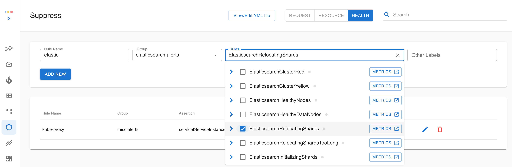
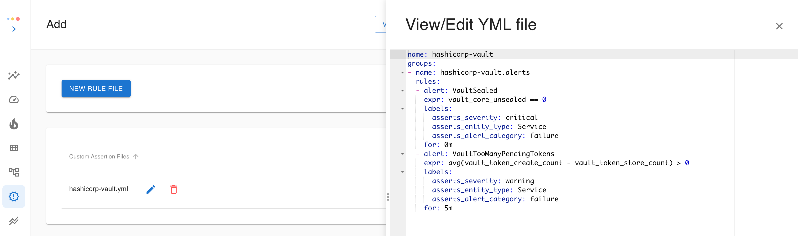

# Rules

### Thresholds

Asserts has curated an assertion library pertaining to our SAAFE model. Internally they are a collection of Prometheus rules with user-configurable thresholds. We divide the threshold configuration into three sections and organize each section by assertion types

* **Request** is about rate, latency, and error assertions
  * Each **Anomaly** is checked against a dynamic range that combines standard deviation and percentage change. Daily and weekly seasonalities are considered. A sparseness check is also implemented to reduce noise on sparse requests.
  * Each **Breach** is checked against a static threshold. **ErrorLogSpike** is also a breach assertion
  * Client **Errors** are treated as anomalies, so follow the anomaly algorithms mentioned above
  * Server **Errors** are tracked with an error budget approach, so they are controlled by fast-burn or slow-burn factors
* The **Resource** section is about CPU, Memory, Disk, Network, etc
  * Each **Saturation** works with two static thresholds, one for warning and one for critical
  * Some resources like disk have rate metrics (bytes read/write), so we have **ResourceRateAnomaly** and **ResourceRateBreach** assertions. They follow the same approach as their request counterparts
* The **Health** section is mostly about all the failure assertions in various domains. We organize the domain rules by groups. Within each group, the user can edit each individual rule.

Besides configuring all the default thresholds, the user can also configure individual thresholds on fine-grained levels. These levels are hierarchical. For requests, if you specify a threshold on `job` level, it applies to all the request types for that job. Similarly, if you specify a threshold on `request_type` level, it applies to all the request contexts for that request type and job.

.png>)

For resources, the hierarchy starts with `source`, i.e., the exporter, then `resource_type,` and then `container`. An additional dimension is `severity`, which is independent of the granularity levels.

### Notifications <a href="#howassertsworks-wip-notifications" id="howassertsworks-wip-notifications"></a>

As we mentioned earlier, assertions are not alerts. If you want to get notified, you can add notification rules. Asserts uses Prometheus Alert Manager for notification internally, so we support all the receivers listed on its official page (Email, Pagerduty, Slack, etc.)

Notifications are organized into different sections, just like the thresholds, and the same hierarchical granularity levels apply. You can set notifications for an assertion whenever it fires or when it fires on a specific `job` or a `job` and `request type`. Free-form label conditions are also supported here.

<figure><figcaption></figcaption></figure>

There is also a quick shortcut from the Workbench to bring you to the notification settings with all the labels pre-populated.

<figure><figcaption></figcaption></figure>

SLO notifications can also be managed here.

<figure><figcaption></figcaption></figure>

### Suppressions <a href="#howassertsworks-wip-suppressions" id="howassertsworks-wip-suppressions"></a>

Similar to notifications, you can also choose a subset of assertions to suppress, so they don’t fire. Suppressed assertions are ignored in Asserts processing. They will not be available in Top Insights, Graph, or the Workbench. Note this is very different from an assertion that fires but does not notify.



### Bring your own <a href="#howassertsworks-wip-additions" id="howassertsworks-wip-additions"></a>

If you have your own rules, you can also bring them into the Asserts system by defining custom assertion rules. You can add them individually on the UI or upload a rule file.



### Entity and Relation

A set of model rules defines Asserts' entity model. Thus, we can extend the model by including more custom rules. There are two model rules: entity rules and relationship rules, and both only rely on Prometheus metrics data. Asserts runs the specified queries and uses the context information in labels to build entities and relationships.

Our default entities rules are carefully curated to cover most scenarios, so we usually do not expect customers to supply additional ones. If you still want to augment the model, you can add your own model rules by uploading a rule file

For example, the `kube_job_labels` metric from KSM usually has a `job_name` label to indicate the k8s job name. We could define a `Job` entity using `job_name` as its identifier, but `job_name` often ends with a GUID, so it may not be the ideal name. In this particular case, the customer has a label `label_framework_task_name` that specifies the name of the framework task that creates all these k8s jobs. Using this task name instead of the `job_name` works better for them. Hence, they define the custom `Job` entity with the `label_framework_task_name` label.

In addition, our Asserts epbf probe also captures k8s job name as the client name in our ebpf connection metrics. We can join this metric with `kube_job_labels` to get the task name and in turn, establish the `ROUTES` relationship from each `Job` to all the `Services` it talks to.

<figure><figcaption></figcaption></figure>

Quite often, custom rules are about relationships between services. To eliminate the management hassle of custom relationship rules, the Asserts platform supports service calls defined by an `asserts:relation:calls` metric. For example, customers can add the following recording rule indicating that `api-server` service calls a shipping service based on the pattern `uri=~"/shipping/.*"` generated by their app, recorded with `http_requests` metric.

```yaml
- record: asserts:relation:calls
  expr: sum by (job, namespace, asserts_env, asserts_site)
         (rate(http_requests{job="api-server", uri=~"/shipping/.*"}[5m]))
  labels:
    dst_job: shipping
    dst_namespace: back-office
```

Note this rule is a custom metric, thus not a custom model rule. It should be added in the [#howassertsworks-wip-additions](assertion-management.md#howassertsworks-wip-additions "mention") section.

### Relabelling

Relabelling rules are used for manipulating labels in the metrics ingestion. They can also be used to rename or drop metrics.

#### Adding new label <a href="#_adding_new_label" id="_adding_new_label"></a>

New label can be added with the following relabeling rule:

```yaml
- target_label: "foo"
  replacement: "bar"
```

This relabeling rule adds **{foo="bar"}** label to all the incoming metrics. For example, **metric{job="aa"}** will be converted to **metric{job="aa",foo="bar"}**.

#### Updating existing label <a href="#_updating_existing_label" id="_updating_existing_label"></a>

Existing label can be updated with the relabeling rule mentioned above:

```yaml
- target_label: "foo"
  replacement: "bar"
```

This rule rewrites **metric{foo="aaaa"}** with **metric{foo="bar"}**.

#### Rewriting existing label <a href="#_rewriting_existing_label" id="_rewriting_existing_label"></a>

The following relabeling rule can be used for removing port part from **instance** label:

```yaml
- source_labels: [instance]
  regex: "([^:]+):.+"
  target_label: "instance"
  replacement: "$1"
```

This rule translates **foo{instance="bar:123"}** to **foo{instance="bar"}**.

How does it work: it extracts **instance** label value (see source\_labels list above), applies the given **regex** to it, then generates **replacement** string (**$1** is substituted by the part of instance label that is matched by regex part in the first parenthesis), and then puts the **replacement** string into **target\_label**.

#### Updating metric name <a href="#_updating_metric_name" id="_updating_metric_name"></a>

\*Metric name can be updated with the following relabeling rule:

```yaml
- source_labels: [__name__]
  regex: "(.+)_suffix"
  target_label: "__name__"
  replacement: "prefix_$1"
```

This rule removes **\_suffix** from metric name and adds **prefix\_** to it. For example, **foo\_suffix{bar="aaa"}** metric would be substituted with **prefix\_foo{bar="aaa"}** with this relabeling rule.

VictoriaMetrics provides additional action — **replace\_all**, which can be used for replacing all the occurrences of the given pattern with something else. For example, the following relabeling rule substitutes all the **.** chars with **\_** chars in metric names:

```yaml
- action: replace_all
  source_labels: [__name__]
  target_label: "__name__"
  regex: "\\."
  replacement: "_"
```

Graphite-like metric **foo.bar.baz** would be substituted with **foo\_bar\_baz** after applying this relabeling rule.

#### Removing unneeded labels <a href="#_removing_unneeded_labels" id="_removing_unneeded_labels"></a>

Sometimes it is needed to remove certain labels before storing metrics in Prometheus or VictoriaMetrics. This can be done with **action: labeldrop**. The name of the label to drop must be specified as a regular expression in **regex** . For example, the following relabeling rule drops all the label names starting with **foo**:

```yaml
- action: labeldrop
  regex: "foo.+"
```

This relabeling rule transforms the following metric: **metric{job="a",instance="xyz",foobar="baz",foox="aaa"} 123** into: **metric{job="a",instance="xyz"} 123**

Sometimes it is needed to drop all the labels except of a few label names matching the given regexp. This can be done with **action: labelkeep**. The following relabeling rule drops all the labels except of **\_\_name\_\_** and labels ending with **keepme**:

```yaml
- action: labelkeep
  regex: "__name__|.*keepme"
```

This means that **metric{job="aa",foo="bar",letskeepme="aaa"}** would be translated to **metric{letskeepme="aaa"}** with the given relabeling rule.

#### Removing the specific label value <a href="#_removing_the_specific_label_value" id="_removing_the_specific_label_value"></a>

The following rule removes **foo="bar"** label value:

```yaml
- source_labels: [foo]
  regex: "bar"
  target_label: foo
  replacement: ""
```

For example, **metric{foo="bar",baz="x"}** becomes **metric{baz="x"}** after applying this relabeling rule, while **metric{foo="xxx"}** remains the same.

#### Removing unneeded metrics <a href="#_removing_unneeded_metrics" id="_removing_unneeded_metrics"></a>

Metrics can be dropped with **action: drop**. For example, the following relabeling rule drops metric if it contains **instance** label starting from **foobar**:

```yaml
- action: drop
  source_labels: [instance]
  regex: "foobar.+"
```

This relabeling rule drops the following metrics:\
**foo{instance="foobar1"}**\
**foo{instance="foobar2",job="xxx",aaa="bb"}**

It doesn’t drop the following metrics:\
**foo{instance="xxx"}**\
**foo{instance="abc",job="xyz"}**

Sometimes it is easier to specify metrics that needs to be preserved instead of metrics that needs to be dropped. In this case **action: keep** must be used:

```yaml
- action: keep
  source_labels: [job]
  regex: "foobar"
```

This relabeling rule preserves metrics with **job** label equal to **foobar**, while other metrics will be dropped.\\

How to drop metrics if they contain certain values for multiple labels? Just enumerate these labels in **source\_labels** and then specify the desired **regex**. Then **source\_labels** contains multiple labels, they are concatenated with **;** char before matching the provided **regex**. For example, the following relabeling rule would drop metric with **{job="foo",instance="bar"}** labels:

```yaml
- action: drop
  source_labels: [job, instance]
  regex: "foo;bar"
```

#### Dropping metrics on certain condition <a href="#_dropping_metrics_on_certain_condition" id="_dropping_metrics_on_certain_condition"></a>

Sometimes it is necessary to drop a metric if it contains two labels with identical values. This can be done with **drop\_if\_equal** action, which is supported by VictoriaMetrics and [vmagent](https://victoriametrics.github.io/vmagent.html). For example, the following relabeling rule would drop metric if it contains identical label values for **real\_port** and **needed\_port**:

```yaml
- action: drop_if_equal
  source_labels: [real_port, needed_port]
```

The rule would drop the following metric: **foo{real\_port="123",needed\_port="123"}**

but would keep the following metric: **foo{real\_port="123",needed\_port="456"}**

VictoriaMetrics also provides\* keep\_if\_equal\* action, which drops metric if its **source\_labels** aren’t equal. This may be useful for filtering out superfluous scrape targets detected by **kubernetes\_sd\_config** — see [these docs](https://victoriametrics.github.io/vmagent.html#troubleshooting) for details.

#### Modifying label names <a href="#_modifying_label_names" id="_modifying_label_names"></a>

Sometimes it is necessary to modify label names. Then **action: labelmap** can be used for this. For example, the following relabeling rule substitutes **foo\_** prefix in all the label names with **bar\_** prefix:

```yaml
- action: labelmap
  regex: "foo_(.+)"
  replacement: "bar_$1"
```

Note that the rule leaves the original label untouched in the metric. I.e. the following metric — **aa{foo\_xx="bb",job="qq"}** — is translated to **aa{foo\_xx="bb",bar\_xx="bb",job="qq"}** by this relabeling rule.

VictoriaMetrics supports additional action — **labelmap\_all** — which allows substituting specified patterns in label names. For example, the following relabeling rule would substitute all the **—** chars with **\_** chars in all the label names:

```yaml
- action: labelmap_all
  regex: "-"
  replacement: "_"
```

This rule translates **foo{a-b="x",qwe-x-zz="aa"}** with **foo{a\_b="x",qwe\_x\_zz="aa"}**.

#### Constructing a label from multiple existing labels <a href="#_constructing_a_label_from_multiple_existing_labels" id="_constructing_a_label_from_multiple_existing_labels"></a>

Suppose a metric has **host** and **port** labels, while you need constructing **address** label with **host:port** contents. This can be done with the following relabeling rule:

```yaml
- source_labels: [host, port]
  separator: ":"
  target_label: "address"
```

This relabeling rule joins **host** and **port** label values with **:** separator and stores the result at **target\_label**.

Sometimes it is necessary to construct a label from parts of existing labels. For example, the **url** label with **http://hostname/path** value must be constructed from **address** and **path** labels, where **address** contains **hostname:port**. This can be done with the following relabeling rule:

```yaml
- source_labels: [address, path]
  regex: "([^:]+):[^;]+;(.*)"
  replacement: "http://$1/$2"
  target_label: "url"
```

By default **source\_labels** are joined with **;** separator before applying **regex** to the resulting string. So the resulting string will contain **address:port;path** value. The given **regex** matches this string and extracts **address** and **path** parts into **$1** and **$2**. Then these values are used for constructing **replacement** string in the form **http://\<address>/\<path>**. Then the resulting string is written into **target\_label**.

#### Chaining relabeling rules <a href="#_chaining_relabeling_rules" id="_chaining_relabeling_rules"></a>

Relabeling rules can be chained. For example, the following rules add **{foo="bar"}** label and remove port from **instance** label:

```yaml
- replacement: "bar"
  target_label: "foo"
- source_labels: [instance]
  regex: "([^:]+):.*"
  replacement: "$1"
  target_label: "instance"
```

Arbitrary number of relabeling rules can be chained.
