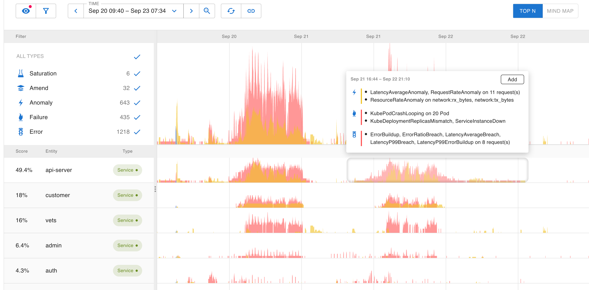
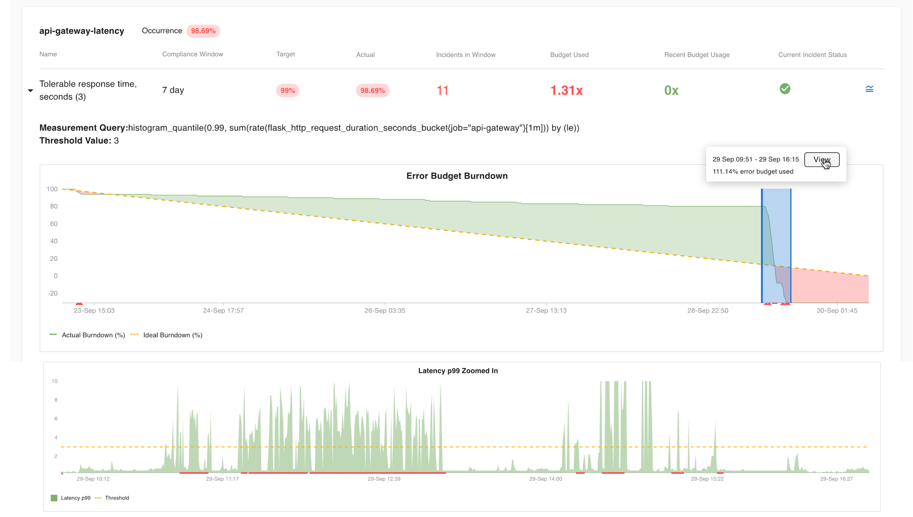

# Check-in

#### Top Insights <a href="howassertsworks-wip-topinsights" id="howassertsworks-wip-topinsights"></a>

Assertions enable us to quantify the overall health of the system. We represent that as top insights on the default landing page.



Here we rank services by their weighted assertion score and present a thumbnail sketch of all the assertions in the system. This helps surface the hot spot in the system so a user can jump right in.

#### SLOs <a href="howassertsworks-wip-slos" id="howassertsworks-wip-slos"></a>

For a more hands-on approach, users can define SLOs based on our normalized metrics or their own metrics. For example, an SLO specification can be defined like the following and posted to our API endpoint or through our configuration UI.

**SLO Definition API**

```
apiVersion: asserts/v1
kind: SLO
name: api-server-availability
indicator:
  kind: Request
  badEventCount: asserts:error:total{job="api-server", asserts_error_type="server_errors"}
  totalEventCount: asserts:request:total{job="api-server"}
entitySearch: "show service api-server"
objectives:
  - ratio: 0.99
    name: "Weekly Availability"
    window:
      kind: Rolling
      days: 7
```

**SLO Definition UI**


**SLO List Page**

Unlike assertions, SLOs are meant for capturing high-level business objectives. The specification is designed to be declarative. Asserts takes care of how it is actually tracked and integrated into our assertion and alerting framework. The SLO list page lists all the SLOs along with their status and summary of budget utilization and incidents.


**SLO Burndown and Incident Timeline**

Clicking an SLO Objective navigates to a view that shows the error budget burndown and the underlying metric. Occurrences of incidents are highlighted on the timeline. Clicking a highlighted incident will show the incident duration and budget burndown. The tooltip has a navigation to go to the **TopInsights **view using the search expression provided in the SLO definition and the time window of the incident



#### Incidents <a href="howassertsworks-wip-incidents" id="howassertsworks-wip-incidents"></a>

We assume the user wants to be notified whenever an SLO is violated, so we list each violation on the Incidents page. Assertions, on the other hand, are not necessarily incidents. A user can choose to treat certain assertions as incidents by enabling notifications on them.

These incidents are grouped by SLOs and assertions and laid out in a common time frame. This is very similar to our WorkBench to help users instantly spot time-based correlation.

### &#x20;<a href="howassertsworks-wip-exploringtheentitygraph" id="howassertsworks-wip-exploringtheentitygraph"></a>
