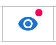

# Entity Graph

#### Search

Asserts’s web app is built for cloud scale. The best way to explore the entity graph is to use search expressions. We’ve shipped a default set of search expressions that cover everyday use cases. For example, "Show Service api-server", “Show all services”, “Show Assertions in Namespace”, etc.

The `Advanced search` panel provides more advanced search functions like searching by property conditions, showing connected entities, etc. These searches can provide context-rich shortcuts to a group of entities users want to view as a whole.

Keep in mind that the graph is constantly updated by the time-series data, so the search result represents the system's state in the specified time window. When you change the time, the search result may change too. In addition, search results are always filtered by the selection in `env` and `site` dropdown.

#### Navigation 

When users click on an entity, it also allows them to navigate to its connected entities. Navigation can be done in both graph view and list view. If the graph gets busy, we can filter the displayed entities by clicking on the entity type in the legends.

In the list view, users can also pick properties or the monitoring status of each entity. This gives a high-level overview of what’s being automatically monitored by Asserts. Resource monitoring applies to both Services and Nodes, but traffic and latency monitoring usually only applies to Services.

<figure><figcaption></figcaption></figure>

A bubble view is also provided to help the user to rank entities by requests, resources, or selected properties from `View Settings` . Users can even choose multiple fields to rank them in the same view. For example, the following rank services by both requests and CPU. The node color indicates the assertion status related to the selected field. Thus, the `yace` service here is having a CPU-related assertion.

#### Entity assertion status 

For each entity, two color-coded rings indicate the assertion status of the entity

* The outer ring indicates the status of the entity itself
* The inner ring shows the status of all the lower-level entities contained within itself

The inner ring helps because, for ephemeral entities like Pods, their containing entity like Nodes or Services are usually more applicable for being focal points for analysis. Thus seeing a colored inner ring on the node/service is helpful.

Red highlights `CRITICAL`, Yellow indicates `WARNING`, and Blue is for `INFO`. As a rule of thumb, _Saturation_ can be either `CRITICAL` or `WARNING`, _Failures are usually_ `CRITICAL`_, Anomalies_ are usually `WARNING`, and _Amends_ are usually `INFO`.

The following example shows a node with a critical CPU load on itself while at the same time, one of the pods hosted on it is experiencing CPU Throttle.

Note: we are merging the two tabs into one in an upcoming release

|  |  |
| ------------------------------------------------ | -------------------------------------------- |

#### Dashboards 

Users can pull up the KPI dashboard for each entity in focus by clicking “Show KPI”. Asserts has curated a library of Grafana dashboards. Each entity type has its own dashboard, so we have a dashboard for Cluster, NodeGroups, Nodes,  Pods, Services, et al.&#x20;

Within the same entity type, say Service, if we know the service type, say `Nginx`, we also have a popular community Grafana dashboard for that service type.

Asserts keeps working on expanding this library. If a customer has their own Grafana dashboards, he/she can also integrate them into Asserts Web App.
