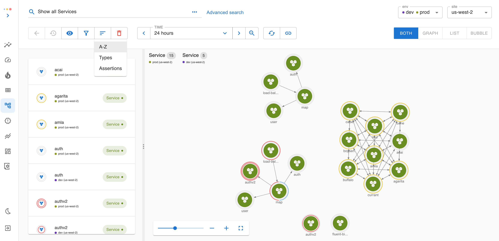
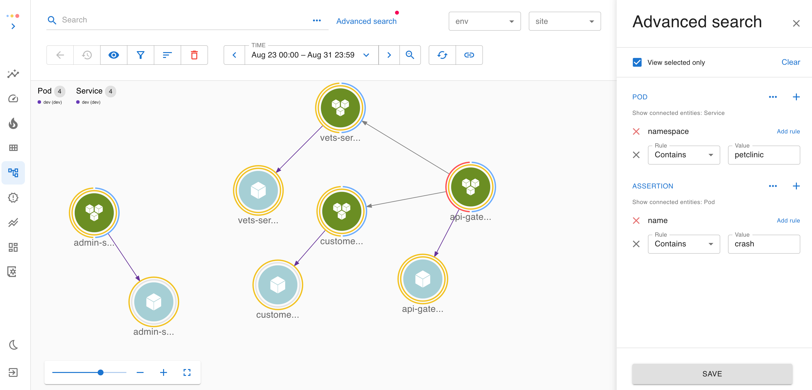
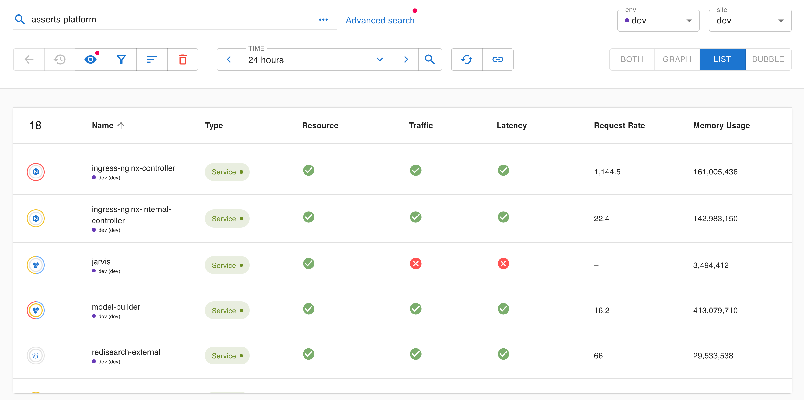
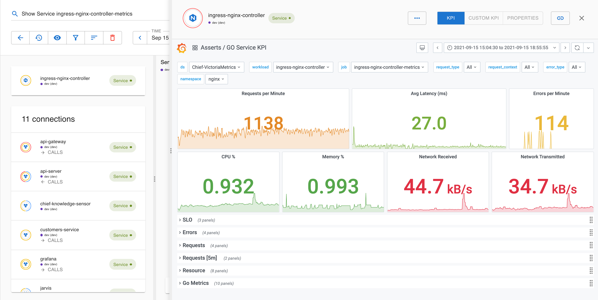
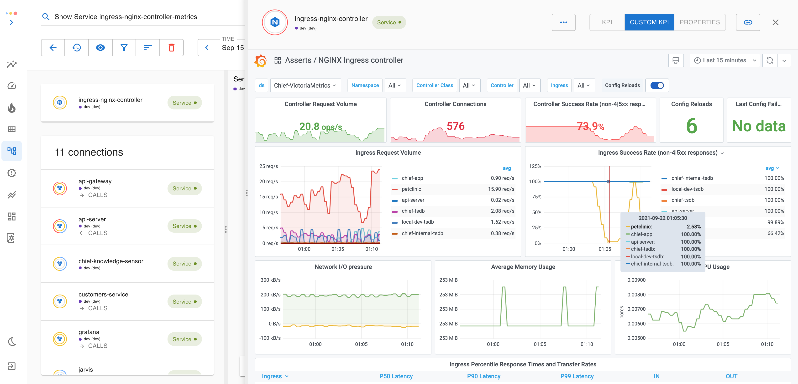

# Exploring the entity graph

### Search

Asserts’s web app is built for cloud-scale. The best way to explore the entity graph is to use search expressions. We’ve shipped a default set of search expressions that cover common use cases. For example "Show Service api-server", “Show all services”, “Show Assertions in Namespace”, etc.

“Advanced search” panel provides more advanced search functions like search by property conditions, show connected entities, etc. These searches can provide context-rich shortcuts to a group of entities that a user wants to look at as a whole.

Keep in mind that the graph is constantly updated by the time-series data, so the search result represents the system's state in the specified time window. When you change the time, the search result may change too. In addition, search results are always filtered by the selection in `env` and `site` dropdown.

#### Navigation 

When a user clicks on an entity, it also allows the user to navigate to its connected entities. Navigation can be done in both graph view and list view. If the graph gets busy, we can filter the displayed entities by clicking on the entity type in the legends.

The list view also contains the monitoring status of each entity. This gives a high-level overview of what’s being automatically monitored by Asserts. Resource monitoring applies to both Services and Nodes, but traffic and latency monitoring usually only applies to Services.

A bubble view is also provided to help the user to rank entities by requests, resources, or selected property  from `View Settings` . The user can even select multiple fields to rank them in the same view. For example, the following rank services by both requests and CPU. The node color indicates the assertion status related to the selected field. Thus `yace` service here is having a CPU-related assertion.

#### Entity assertion status 

For each entity, two color-coded rings indicate the assertion status of the entity

* The outer ring indicates the status of the entity itself
* The inner ring indicates the status of all the lower-level entities contained within itself

The inner ring helps because, for ephemeral entities like Pods, their containing entity like Nodes or Services are usually more applicable for being focal points for analysis. Thus seeing a colored inner ring on the node/service itself is useful.

Red highlights CRITICAL, Yellow indicates WARNING, and Blue is for INFO. As a rule of thumb, _Saturation_ can be either CRITICAL or WARNING, _Failure\_s are usually CRITICAL, \_Anomalies_ are usually _WARNING_, and _Amends_ are usually INFO.

The following example shows a node that has a critical CPU load on itself, while at the same time, one of the pods hosted on it is experiencing CPU Throttle.

Note: we are merging the two tabs into one in an upcoming release

|  |  |
| :--- | :--- |

#### Dashboards 

A user can pull up the KPI dashboard for each entity in focus by clicking “Show KPI”. Asserts has curated a library of Grafana dashboards. Each entity type has its own dashboard, so we have a dashboard for Cluster, NodeGroups, Nodes,  Pods, Services et al. 

Within the same entity type, say Service, if we know the service type, say `Nginx`, we also have a specific dashboard for that service type.

Asserts keeps working on expanding this library. If a customer has their own grafana dashboards, he/she can also integrate them into Asserts Web App.

