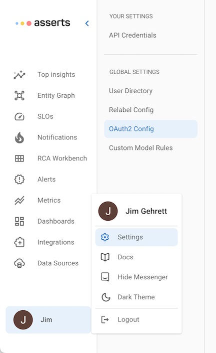
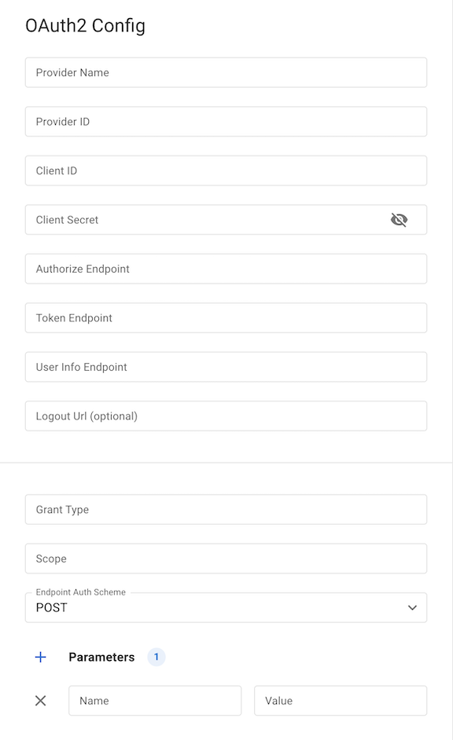
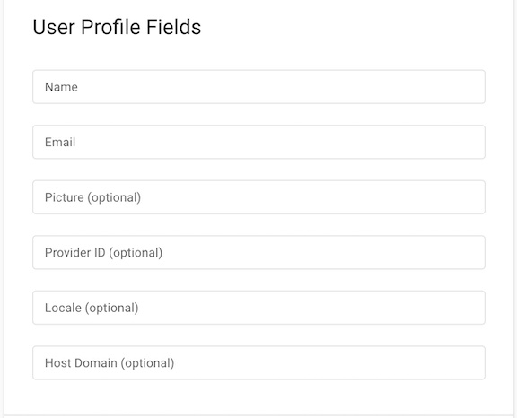
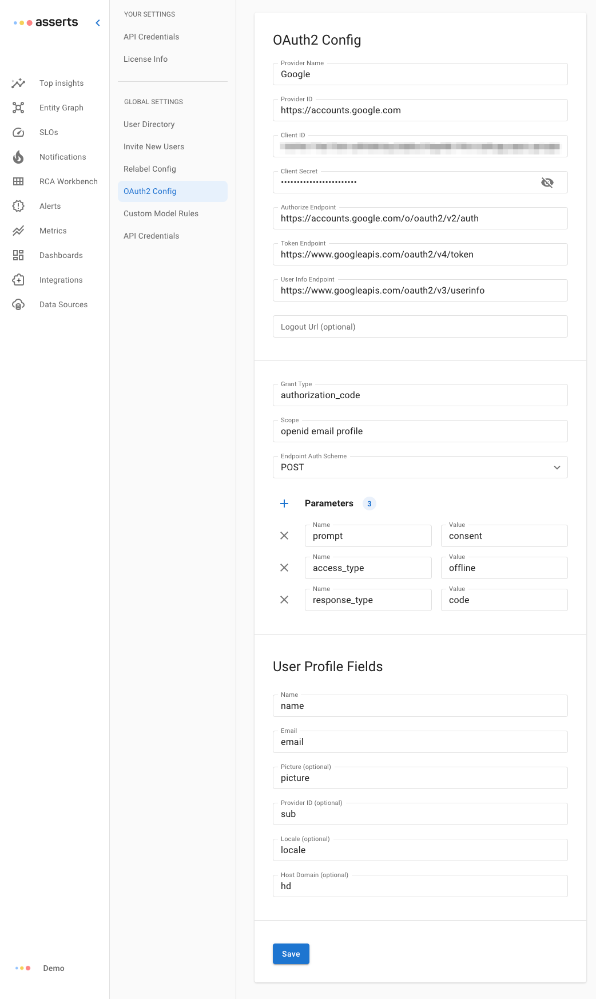

# Authentication (SSO)

Asserts uses OAuth2 and OIDC for Single Sign On (SSO). For users with the Owner role, this configuration can be found in the Asserts Settings page. Note that SSO is not available with a Freemium license

<figure><figcaption>
Auth config from the Settings menu
</figcaption></figure>

### OAuth2 Config Screen

Once on the OAuth2 Config screen, we can set the configuration properties.&#x20;

<figure><figcaption></figcaption></figure>

The properties include:

* **Provider Name** - The name of the provider defined by you. This is just used for reference and a mapping to an associated sign in button graphic. Current included button graphic names are: Google, Okta, Apple, OneLogin
* **Provider ID** - The unique identifier of this IDP defined by you
* **Client ID** - Unique ID created within the IDP
* **Client Secret** - Unique secret created within the IDP
* **Authorize Endpoint** - IDP authorization endpoint
* **Token Endpoint** - IDP token endpoint
* **User Info Endpoint** - Optional IDP endpoint for user profile information
* **Logout Endpoint** - An optional logout template URL following the [OpenID logout spec](https://openid.net/specs/openid-connect-rpinitiated-1\_0.html#RPLogout)
  * The URL template you provide must include a value for the id\_token_\__hint parameter defined in the spec. This is done through the template binding of __ {id_\__token}
* **Grant Type** - The grant type(s) for this IDP (generally `authorization_code`)
* **Scope** - Space separated scope fields defined by the IDP to be able to access the user profile as well as name & email
* **Endpoint Auth Scheme** - Either `POST` or `BASIC` depending on the IDP
* **Parameters** - the parameters required by the IDP to support an id auth & refresh token
  * Includes `response_type: code` plus any other IDP specific parameters

### User Profile Fields

<figure><figcaption></figcaption></figure>

When available, Asserts will query the IDP user info endpoint to build the user profile. There are several user profile fields in Asserts and these properties may be referenced with different key names in the IDP. Therefore, we have built a mapping mechanism for these fields. For the following properties, enter the corresponding key value for the user info response.

The Asserts properties are as follows:

* **Name** - The user's full name (required)
* **Email** - the user's email address (required)
* **Picture** - The user's profile picture
* **Provider ID** - The unique ID of the user in the IDP
* **Locale** - The user's locale
* **Hosted Domain** - The hosted domain to which this user belongs

### Verified IDPs

At Asserts we have verified the SSO flow for the following IDPs. Also included are the proper properties for Grant Type, Scope, Parameters and User Profile mappings

| Provider     | Fields                                                                                                                                                                                                                                                                                                                                                                                                                                                                                                                                                                                                                                                     |
| ------------ | ---------------------------------------------------------------------------------------------------------------------------------------------------------------------------------------------------------------------------------------------------------------------------------------------------------------------------------------------------------------------------------------------------------------------------------------------------------------------------------------------------------------------------------------------------------------------------------------------------------------------------------------------------------- |
| **Apple**    | <ul><li><strong>name</strong>: Apple</li><li><strong>grant_type</strong>: authorization_code</li><li><strong>scope</strong>: openid</li><li>
<strong>params</strong>:
<ul><li><strong>response_type</strong>: code</li></ul></li><li>
User Profile
<ul><li><strong>name</strong>: name</li><li><strong>email</strong>: email</li></ul></li></ul>                                                                                                                                                                                                                                                                                                 |
| **Auth0**    | <ul><li><strong>name</strong>: Auth0</li><li>
User Profile
<ul><li><strong>name</strong>: name</li><li><strong>email</strong>: email:</li><li><strong>locale</strong>: locale</li><li><strong>picture</strong>: picture</li><li><strong>providerUserId</strong>: sub</li></ul></li><li>
<strong>params</strong>
<ul><li><strong>response_type</strong>: code</li></ul></li><li><strong>scope</strong>: openid email profile offline_access name picture</li><li><strong>grant_type</strong>: authorization_code</li></ul>                                                                                                                        |
| **Google**   | <ul><li><strong>name</strong>: <strong></strong> Google</li><li>
User Profile
<ul><li><strong>name</strong>: name</li><li><strong>email</strong>: email</li><li><strong>locale</strong>: locale</li><li><strong>picture</strong>: picture</li><li><strong>hostedDomain</strong>: hd</li><li><strong>providerUserId</strong>: sub</li></ul></li><li>
<strong>params</strong>
<ul><li><strong>prompt</strong>: consent</li><li><strong>access_type</strong>: offline</li><li><strong>response_type</strong>: code</li></ul></li><li><strong>scope</strong>: openid email profile</li><li><strong>grant_type</strong>: authorization_code</li></ul> |
| **Okta**     | <ul><li><strong>name</strong>: Okta</li><li>
User Profile
<ul><li><strong>name</strong>: name</li><li><strong>email</strong>: email</li><li><strong>locale</strong>: locale</li><li><strong>picture</strong>: profile</li><li><strong>providerUserId</strong>: preferred_username</li></ul></li><li>
<strong>params</strong>:
<ul><li><strong>response_type</strong>: code</li></ul></li><li><strong>scope</strong>: openid email profile offline_access</li><li><strong>grant_type</strong>: authorization_code</li></ul>                                                                                                                       |
| **OneLogin** | <ul><li><strong>name</strong>: OneLogin</li><li><strong>grant_type</strong>: authorization_code</li><li><strong>scope</strong>: openid name profile groups email params phone</li><li>
<strong>params</strong>:
<ul><li><strong>response_type</strong>: code</li></ul></li><li>
User Profile
<ul><li><strong>name</strong>: name</li><li><strong>email</strong>: email</li><li><strong>locale</strong>: locale</li><li><strong>picture</strong>: profile</li><li><strong>providerUserId</strong>: preferred_username</li></ul></li></ul>                                                                                                         |
| **PingOne**  | <ul><li><strong>name</strong>: PingOne</li><li><strong>grant_type</strong>: authorization_code</li><li><strong>scope</strong>: openid name profile email phone address</li><li>
<strong>params</strong>:
<ul><li><strong>response_type</strong>: code</li></ul></li><li>
User Profile
<ul><li><strong>name</strong>: name</li><li><strong>email</strong>: email</li><li><strong>locale</strong>: locale</li><li><strong>picture</strong>: profile</li><li><strong>providerUserId</strong>: preferred_username</li></ul></li></ul>                                                                                                                |

### IDP Configuration

To allow Asserts access to your IDP you must configure an authorized origin and redirect URI at a minimum. In addition, your IDP may support direction to a login and/or logout URI.&#x20;

The values you should use are as follows:

* authorized origin - `http(s)://<your Asserts hostname>`
* redirect URI - `http(s)://<your Asserts hostname>/authorized`
* login URI - `http(s)://<your Asserts hostname>/login`
* logout URI - `http(s)://<your Asserts hostname>/logout`

### Sample Google IDP Configuration

<figure><figcaption></figcaption></figure>
