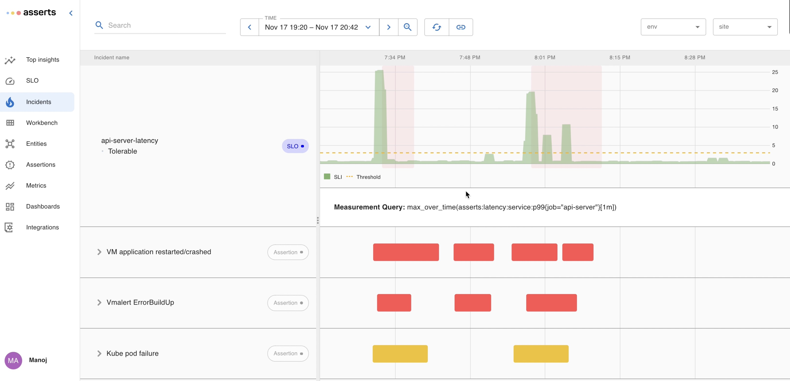

# Manage SLOs

#### SLOs <a href="#howassertsworks-wip-slos" id="howassertsworks-wip-slos"></a>

Unlike assertions, SLOs are meant to capture high-level business objectives and help reduce alert fatigue. Asserts makes it extremely easy to define SLOs for your services. Asserts automatically tracks the SLO, reports violations as Incidents that are integrated into the assertion and alerting framework. You can define SLOs through the UI or through the API

**Availability SLO using Simple UI**

Defining an SLO through the UI is very simple. Navigate to the `Manage SLOs` page, click the add new SLO, select your service, and optionally one or more specific APIs. You can also associate the SLO definition with a search expression or a saved search.&#x20;


#### Availability SLO using Advanced UI

The advanced UI allows specifying custom prometheus queries to define the SLO.


#### Latency SLO using Simple UI


#### Latency SLO using Advanced UI


**SLO Definition API**

SLOs can also be defined through an API. Here is an example of a SLO API request to define an SLO.&#x20;

```
apiVersion: asserts/v1
kind: SLO
name: api-server-availability
indicator:
  kind: Request
  badEventCount: asserts:error:total{job="api-server", asserts_error_type="server_errors"}
  totalEventCount: asserts:request:total{job="api-server"}
entitySearch: "show service api-server"
objectives:
  - ratio: 0.99
    name: "Weekly Availability"
    window:
      kind: Rolling
      days: 7
```

**SLO List Page**

The SLO list page lists all the SLOs and their status and a summary of budget utilization and incidents.


**SLO Burndown and Incident Timeline**

Clicking an SLO Objective navigates to a view that shows the error budget burndown and the underlying metric. Occurrences of incidents are highlighted on the timeline. Clicking a highlighted incident will show the incident duration and budget burndown. The tooltip shows the incident time window and budget burn down. By clicking `View` , you can navigate to [Top Insights](https://docs.asserts.ai/user-guide/check-in#howassertsworks-wip-topinsights) to start RCA of the incident.&#x20;


#### Incidents <a href="#howassertsworks-wip-incidents" id="howassertsworks-wip-incidents"></a>

We assume the user wants to be notified whenever an SLO is violated, so we list each violation on the Incidents page. Assertions, on the other hand, are not necessarily incidents. A user can choose to treat certain assertions as incidents by enabling notifications on them.

These incidents are grouped by SLOs and assertions and laid out in a common time frame. This is very similar to the [WorkBench](https://docs.asserts.ai/user-guide/rca-with-the-workbench) which enables instant time-based correlation.


