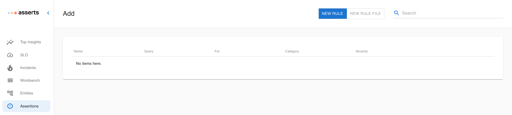

# RCA with the Workbench

The traditional way of troubleshooting usually involves pulling out a few dashboards, open a metrics browser and add a few metrics, and perhaps open a few more browser windows for logs and other things. Quite often you realize the dashboards are out-of-date, or you don’t know which metrics to pull, or it takes you 5 minutes just trying to zoom into the time range to focus on. The list of annoyance can be quite long.

Asserts has automatically surfaced all the assertions in the system, and enriched them with all the context. At times, just a glance over top insights, or a search into the graph can reveal what’s going on. For more hands-on troubleshooting, we build a Workbench for manually analyzing assertions.

The workflow for the Workbench is similar to a pinboard. Whether a user is just glancing through top insights or incidents, or exploring the entities in the graph, there is always a pin button “+” or “Add” to add entities, assertions, or the result of a search expression to the Workbench. Once they are in the Workbench, they are laid out in a common time frame, so if there is any causality in between, it will pop up right in front of you.

The search box also works for the Workbench, so a user can quickly add more entities to the Workbench for root cause analysis. We also integrate with logging systems to help the user quickly jump into the logs with the time range pre-populated.

The timeline view is not the only view option. A user can also choose the graph view to evaluate the impact of the current issues and spot spatial correlation on the graph.

Mindmap view provides a way to walk down the assertions by categories and assertion types, instead of by entities. This view helps to spot the common problem across many different entities.

