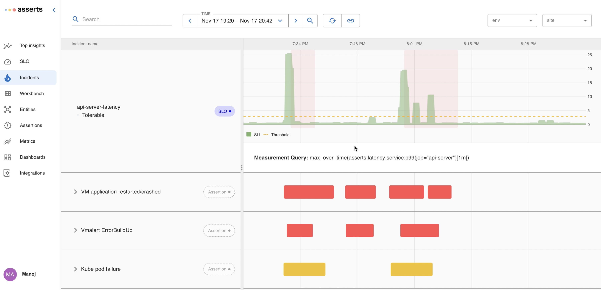

# SLOs

#### SLOs <a href="#howassertsworks-wip-slos" id="howassertsworks-wip-slos"></a>

SLOs are meant to capture high-level business objectives and help reduce alert fatigue. Asserts makes it extremely easy to define SLOs for your services. Asserts automatically tracks the SLO, and reports each violation on the Incidents page. You can define SLOs through the UI or through the API.

#### **Manage SLOs**

**Availability SLO using Simple UI**

Defining an SLO through the UI is very simple. Navigate to the `Manage SLOs` page, click the add new SLO, select your service, and optionally one or more specific APIs. You can also associate the SLO definition with a search expression or a saved search.&#x20;


#### Availability SLO using Advanced UI

The advanced UI allows specifying custom Prometheus queries to define the SLO.


#### Latency SLO using Simple UI


#### Latency SLO using Advanced UI


The latency P99 is computed for each minute. Let's say the threshold is 100ms. So each minute that the P99 is within the threshold is a good minute and each minute when P99 is above this threshold is a bad minute.&#x20;

Here is a table that summaries the SLO in terms of tolerated bad minutes or expected good minutes in a day

```
#  _________________________________________________________________________________________________________________
#       |        |          | 30 day Error  | Fast Burn       |   Slow Burn     |  Fast Burn Alert Behaviour       |
#  Bad  |   Good |    SLO   | Budget        | 2% in 1 hour    |   5% in 6 hours |                                  |
#  ----------------------------------------------------------------------------------------------------------------
#       |        |          |               |                 |                 | Triggers for every bad minute    |
#   1   |   1439 |   99.93  |       30      |      36s        |    2m 30s       | Each alert lasts for 5m          |
#  ----------------------------------------------------------------------------------------------------------------
#       |        |          |               |                 |                 | Triggers on the 4th and every    |
#       |        |          |               |                 |                 | subsequent bad minute in a 1 hour|
#   5   |   1435 |   99.65  |      150      |       3m        |    7m 30s       | window. Each alert lasts for 5m  |
#  ----------------------------------------------------------------------------------------------------------------
#       |        |          |               |                 |                 | Triggers on the 7th and every    |
#       |        |          |               |                 |                 | subsequent bad minute in a 1 hour|
#  10   |   1430 |   99.31  |      300      |       6m        |    15m          | window. Each alert lasts for 5m  |
#  ----------------------------------------------------------------------------------------------------------------
#       |        |          |               |                 |                 | Triggers on the 10th and every   |
#       |        |          |               |                 |                 | subsequent bad minute in a 1 hour|
#  15   |   1425 |   98.95  |      450      |       9m        |    22m 30s      | window. Each alert lasts for 5m  |
#  ----------------------------------------------------------------------------------------------------------------
#       |        |          |               |                 |                 | Triggers when there are 2 bad    |
#       |        |          |               |                 |                 | minutes in last 5 minutes and 19 |
#  30   |   1410 |   97.91  |      900      |      18m        |    45m          | bad minutes in last 1 hour. Each |
#       |        |          |               |                 |                 | alert lasts for 5m               |
#  ----------------------------------------------------------------------------------------------------------------
#       |        |          |               |                 |                 | Triggers when there are 2 bad    |
#       |        |          |               |                 |                 | minutes in last 5 minutes and 22 |
#  36   |   1404 |   97.50  |     1080      |     21m 36s     |    54m          | bad minutes in last 1 hour. Each |
#       |        |          |               |                 |                 | alert lasts for 5m               |
#  ----------------------------------------------------------------------------------------------------------------
#       |        |          |               |                 |                 | Triggers when there are 2 bad    |
#       |        |          |               |                 |                 | minutes in last 5 minutes and 37 |
#  60   |   1380 |   95.83  |     1800      |     36m         |    90m          | bad minutes in last 1 hour. Each |
#       |        |          |               |                 |                 | alert lasts for 5m               |
###################################################################################################################
```

**SLO Definition API**

SLOs can also be defined through an API. Here is an example of an SLO API request to define an SLO.&#x20;

```
apiVersion: asserts/v1
kind: SLO
name: api-server-availability
indicator:
  kind: Request
  badEventCount: asserts:error:total{job="api-server", asserts_error_type="server_errors"}
  totalEventCount: asserts:request:total{job="api-server"}
entitySearch: "show service api-server"
objectives:
  - ratio: 0.99
    name: "Weekly Availability"
    window:
      kind: Rolling
      days: 7
```

#### **SLO List Page**

The SLO list page lists all the SLOs and their status and a summary of budget utilization and incidents.


**SLO Burndown and Incident Timeline**

Clicking an SLO Objective navigates to a view that shows the error budget burndown and the underlying metric. Occurrences of incidents are highlighted on the timeline. Clicking a highlighted incident will show the incident duration and budget burndown. The tooltip shows the incident time window and budget burn down. By clicking `View` , you can navigate to [Workbench](workbench.md) to start the RCA of the incident.&#x20;


#### Incidents <a href="#howassertsworks-wip-incidents" id="howassertsworks-wip-incidents"></a>

We assume the user wants to be notified whenever an SLO is violated, so we list each violation on the Incidents page. Assertions, on the other hand, are not necessarily incidents. A user can choose to treat certain assertions as incidents by enabling notifications on them.

These incidents are grouped by SLOs and assertions and laid out in a common time frame. This is very similar to the [WorkBench](https://docs.asserts.ai/user-guide/rca-with-the-workbench) which enables instant time-based correlation.


