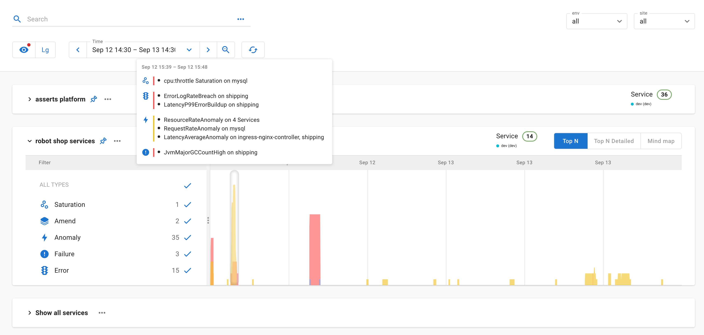
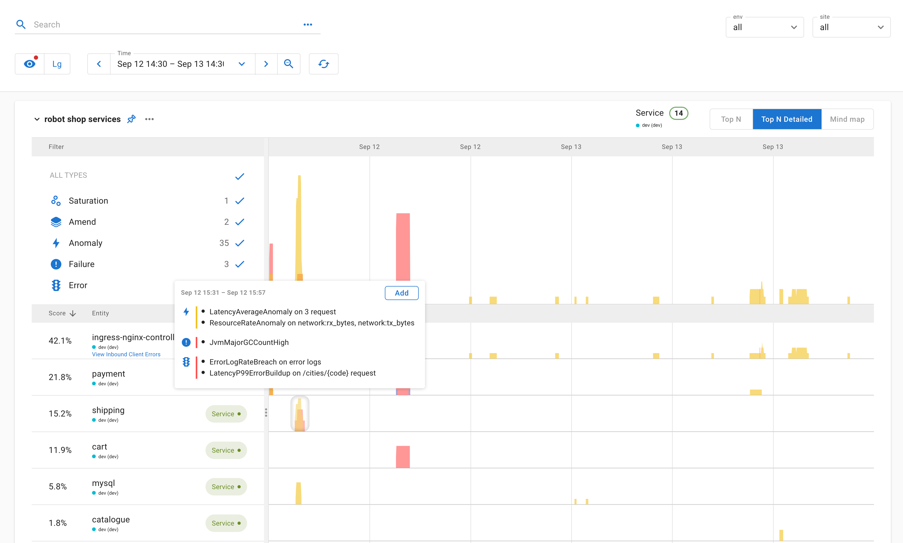
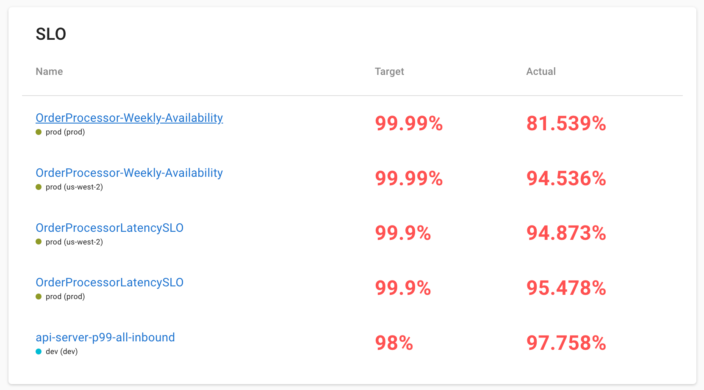
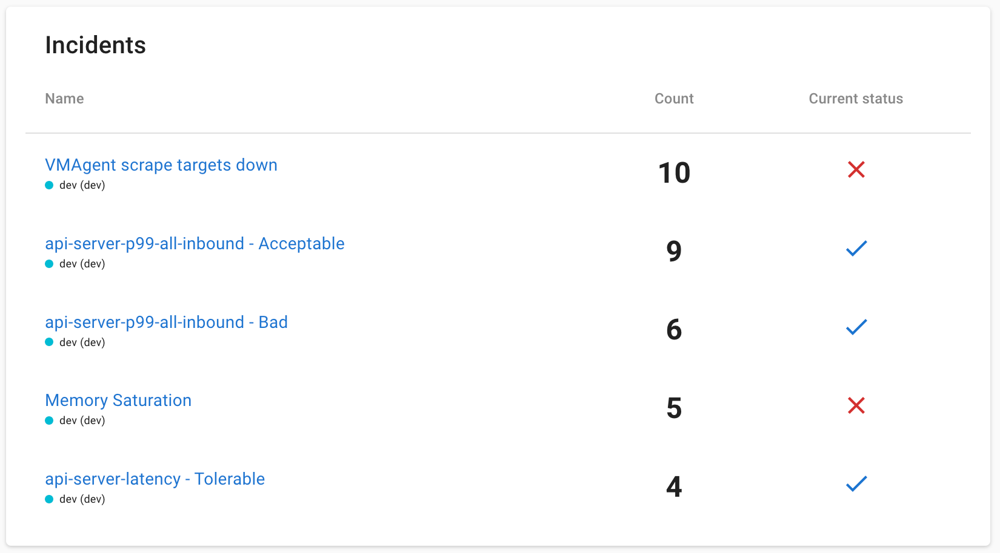

# Top Insights

#### Top Insights 

Assertions enable us to quantify the overall health of the system. We represent that as top insights on the default landing page.

<figure><figcaption></figcaption></figure>

Here we present a thumbnail sketch of all the assertions for the entities that match the search expression. This helps surface the hot spots in the system so a user can jump right in. By default, the health of the top services and top nodes are shown. By 'top' we mean the entities that have the most assertions and are the ones that would require attention. The user can customize this to use a different search expression that matches their needs. On hovering over the thumbnail sketch, a tooltip summarizing the assertions that happened during that period is presented.

<figure><figcaption></figcaption></figure>

The '**Top N Detailed**' tab shows the breakdown by entities that match the search expression ranked by their weighted assertion scores.

**Top SLOs**

The Top Insights page also summarizes the health of the SLOs defined in Asserts. The SLOs are sorted by the ones that have consumed the most error budgets.

<figure><figcaption></figcaption></figure>

Clicking on an SLO would navigate the user to the corresponding SLO on the SLO List page.

**Top Incidents**

The incidents section lists the most frequently occurring incidents in the selected time range.

<figure><figcaption></figcaption></figure>

Clicking on an incident would navigate the user to the corresponding incident on the Incidents List page.
